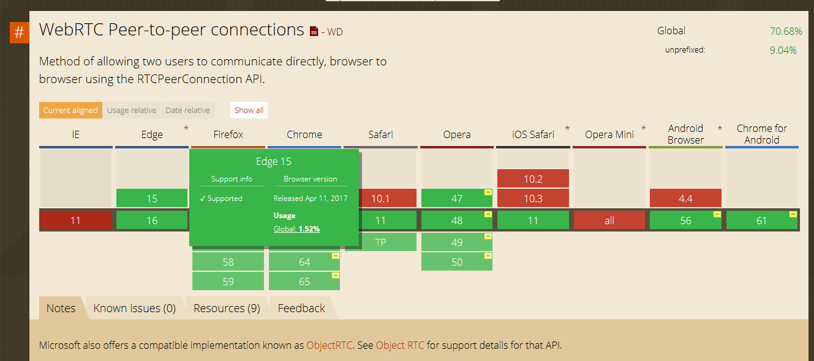

# WebRTC 

## <a name='toc'>目录</a>

1. [什么是WebRTC？](#what-is-webrtc)
2. [浏览器兼容情况](#nodejs-install)
3. [特点](#features)
4. [WebRTC架构图](#webrtc-structure)
5. [WebRTC架构组件介绍](#component-introduction)
6. [WebRTC核心模块API](#core-module-api)

## <a name='what-is-webrtc'>一、什么是WebRTC？</a>

​       众所周知，浏览器本身不支持相互之间直接建立信道进行通信，都是通过服务器进行中转。比如现在有两个客户端，甲和乙，他们俩想要通信，首先需要甲和服务器、乙和服务器之间建立信道。甲给乙发送消息时，甲先将消息发送到服务器上，服务器对甲的消息进行中转，发送到乙处，反过来也是一样。这样甲与乙之间的一次消息要通过两段信道，通信的效率同时受制于这两段信道的带宽。同时这样的信道并不适合数据流的传输，如何建立浏览器之间的点对点传输，一直困扰着开发者。WebRTC应运而生。

​       WebRTC，名称源自网页实时通信（Web Real-Time Communication）的缩写，是一个支持网页浏览器进行实时语音对话或视频对话的技术，是谷歌2010年以6820万美元收购Global IP Solutions公司而获得的一项技术。2011年5月开放了工程的源代码，在行业内得到了广泛的支持和应用，成为下一代视频通话的标准。

​       WebRTC是一个开源项目，旨在使得浏览器能为实时通信（RTC）提供简单的JavaScript接口。说的简单明了一点就是让浏览器提供JS的即时通信接口。这个接口所创立的信道并不是像WebSocket一样，打通一个浏览器与WebSocket服务器之间的通信，而是通过一系列的信令，建立一个浏览器与浏览器之间（peer-to-peer）的信道，这个信道可以发送任何数据，而不需要经过服务器。并且WebRTC通过实现MediaStream，通过浏览器调用设备的摄像头、话筒，使得浏览器之间可以传递音频和视频。

## <a name='what-webrtc'>二、浏览器兼容情况</a>

​       这么好的功能，各大浏览器厂商自然不会置之不理。现在WebRTC已经可以在较新版的Chrome、Opera和Firefox、Edge中使用了，著名的浏览器兼容性查询网站[caniuse](http://caniuse.com/#feat=rtcpeerconnection)上给出了一份详尽的浏览器兼容情况：

## <a name='features'>三、特点</a>

​       WebRTC实现了基于网页的视频会议，标准是WHATWG 协议，目的是通过浏览器提供简单的javascript就可以达到实时通讯（Real-Time Communications (RTC)）能力。

​        WebRTC（Web Real-Time Communication）项目的最终目的主要是让Web开发者能够基于浏览器（Chrome\FireFox\...）轻易快捷开发出丰富的实时多媒体应用，而无需下载安装任何插件，Web开发者也无需关注多媒体的数字信号处理过程，只需编写简单的Javascript程序即可实现，W3C等组织正在制定Javascript 标准API，目前是[WebRTC 1.0版本](http://w3c.github.io/webrtc-pc/)，Draft状态；另外WebRTC还希望能够建立一个多互联网浏览器间健壮的实时通信的平台，形成开发者与浏览器厂商良好的生态环境。同时，Google也希望和致力于让WebRTC的技术成为HTML5标准之一，可见Google布局之深远。

​        WebRTC提供了视频会议的核心技术，包括音视频的采集、编解码、网络传输、显示等功能，并且还支持跨平台：windows，linux，mac，android。

## <a name='webrtc-structure'>四、WebRTC架构图</a>

#### 

架构图颜色标识说明：

（1）紫色部分是Web开发者API层；

（2）蓝色实线部分是面向浏览器厂商的API层（也就是红色框标内模块，也是本人专注研究的部分）;

（3）蓝色虚线部分浏览器厂商可以自定义实现。

## <a name='component-introduction'>五、WebRTC架构组件介绍</a>

​ **(1) Your Web App**
​	Web开发者开发的程序，Web开发者可以基于集成WebRTC的浏览器提供的web API开发基于视频、音频的实时通信应用。

**(2) Web API**
​	面向第三方开发者的WebRTC标准API（Javascript），使开发者能够容易地开发出类似于网络视频聊天的web应用，最新的标准化进程可以查看[**这里**](http://dev.w3.org/2011/webrtc/editor/webrtc.html)。
**(3) WebRTC Native C++ API**
​	本地C++ API层，使浏览器厂商容易实现WebRTC标准的Web API，抽象地对数字信号过程进行处理。

**(4) Transport / Session**

​	传输/会话层，会话层组件采用了libjingle库的部分组件实现，无须使用xmpp/jingle协议

​	**a.  RTP Stack协议栈**
​	Real Time Protocol
​	**b.  STUN/ICE**
​	可以通过STUN和ICE组件来建立不同类型网络间的呼叫连接。
​	**c.  Session Management**
​	一个抽象的会话层，提供会话建立和管理功能。该层协议留给应用开发者自定义实现。

**(5) VoiceEngine**
​	音频引擎是包含一系列音频多媒体处理的框架，包括从视频采集卡到网络传输端等整个解决方案。
PS：VoiceEngine是WebRTC极具价值的技术之一，是Google收购GIPS公司后开源的。在VoIP上，技术业界领先，后面的文章会详细了解

​	**a.  iSAC**

​	Internet Speech Audio Codec

​	针对VoIP和音频流的宽带和超宽带音频编解码器，是WebRTC音频引擎的默认的编解码器
​	采样频率：16khz，24khz，32khz；（默认为16khz）
​	自适应速率为10kbit/s ~ 52kbit/；
​	自适应包大小：30~60ms；
​	算法延时：frame + 3ms

​	**b.  iLBC**
​	Internet Low Bitrate Codec
​	VoIP音频流的窄带语音编解码器
​	采样频率：8khz；
​	20ms帧比特率为15.2kbps
​	30ms帧比特率为13.33kbps
​	标准由IETF RFC3951和RFC3952定义

​	**c.  NetEQ for Voice**

​	针对音频软件实现的语音信号处理元件

​	NetEQ算法：自适应抖动控制算法以及语音包丢失隐藏算法。使其能够快速且高解析度地适应不断变化的网络环境，确保音质优美且缓冲延迟最小。是GIPS公司独步天下的技术，能够有效的处理由于网络抖动和语音包丢失时候对语音质量产生的影响。

​	PS：NetEQ 也是WebRTC中一个极具价值的技术，对于提高VoIP质量有明显效果，加以AEC\NR\AGC等模块集成使用，效果更好。

​	**d.  Acoustic Echo Canceler (AEC)**
​	回声消除器是一个基于软件的信号处理元件，能实时的去除mic采集到的回声。

​	**e.  Noise Reduction (NR)**
​	噪声抑制也是一个基于软件的信号处理元件，用于消除与相关VoIP的某些类型的背景噪声（嘶嘶声，风扇噪音等等… …）

**(6) VideoEngine**
​	WebRTC视频处理引擎
​	VideoEngine是包含一系列视频处理的整体框架，从摄像头采集视频到视频信息网络传输再到视频显示整个完整过程的解决方案。

​	**a.  VP8**
​	视频图像编解码器，是WebRTC视频引擎的默认的编解码器
​	VP8适合实时通信应用场景，因为它主要是针对低延时而设计的编解码器。
​	PS:VPx编解码器是Google收购ON2公司后开源的，VPx现在是WebM项目的一部分，而WebM项目是Google致力于推动的HTML5标准之一

​	**b.  Video Jitter Buffer**
​	视频抖动缓冲器，可以降低由于视频抖动和视频信息包丢失带来的不良影响。

​	**c.  Image enhancements**
​	图像质量增强模块
​	对网络摄像头采集到的图像进行处理，包括明暗度检测、颜色增强、降噪处理等功能，用来提升视频质量。

## <a name='core-module-api'>六、WebRTC核心模块API</a>

#### (1)、网络传输模块：libjingle

WebRTC重用了libjingle的一些组件，主要是network和transport组件，关于libjingle的文档资料可以查看[**这里**](http://code.google.com/apis/talk/libjingle/developer_guide.html)。

#### (2)、音频、视频图像处理的主要数据结构

**常量\VideoEngine\VoiceEngine**

*注意：以下所有的方法、类、结构体、枚举常量等都在webrtc命名空间里*

| **类、结构体、枚举常量**        | **头文件**        | **说明**                                   |
| --------------------- | -------------- | ---------------------------------------- |
| **Structures**        | common_types.h | Lists the structures common to the VoiceEngine & VideoEngine |
| **Enumerators**       | common_types.h | List the enumerators common to the  VoiceEngine & VideoEngine |
| **Classes**           | common_types.h | List the classes common to VoiceEngine & VideoEngine |
| class **VoiceEngine** | voe_base.h     | How to allocate and release resources for the VoiceEngine using factory methods in the VoiceEngine class. It also lists the APIs which are required to enable file tracing and/or traces as callback messages |
| class **VideoEngine** | vie_base.h     | How to allocate and release resources for the VideoEngine using factory methods in the VideoEngine class. It also lists the APIs which are required to enable file tracing and/or traces as callback messages |

#### **(3)、音频引擎（VoiceEngine）模块 APIs**

*下表列的是目前在 VoiceEngine中可用的sub APIs*

| **sub-API**            | **头文件**                | **说明**                                   |
| ---------------------- | ---------------------- | ---------------------------------------- |
| **VoEAudioProcessing** | voe_audio_processing.h | Adds support for Noise Suppression (NS), Automatic Gain Control (AGC) and Echo Control (EC). Receiving side VAD is also included. |
| **VoEBase**            | voe_base.h             | Enables full duplex VoIP using G.711.**NOTE:** This API must always be created. |
| **VoECallReport**      | voe_call_report.h      | Adds support for call reports which contains number of dead-or-alive detections, RTT measurements, and Echo metrics. |
| **VoECodec**           | voe_codec.h            | Adds non-default codecs (e.g. iLBC, iSAC, G.722 etc.), Voice Activity Detection (VAD) support. |
| **VoEDTMF**            | voe_dtmf.h             | Adds telephone event transmission, DTMF tone generation and telephone event detection. (Telephone events include DTMF.) |
| **VoEEncryption**      | voe_encryption.h       | Adds external encryption/decryption support. |
| **VoEErrors**          | voe_errors.h           | Error Codes for the VoiceEngine          |
| **VoEExternalMedia**   | voe_external_media.h   | Adds support for external media processing and enables utilization of an external audio resource. |
| **VoEFile**            | voe_file.h             | Adds file playback, file recording and file conversion functions. |
| **VoEHardware**        | voe_hardware.h         | Adds sound device handling, CPU load monitoring and device information functions. |
| **VoENetEqStats**      | voe_neteq_stats.h      | Adds buffer statistics functions.        |
| **VoENetwork**         | voe_network.h          | Adds external transport, port and address filtering, Windows QoS support and packet timeout notifications. |
| **VoERTP_RTCP**        | voe_rtp_rtcp.h         | Adds support for RTCP sender reports, SSRC handling, RTP/RTCP statistics, Forward Error Correction (FEC), RTCP APP, RTP capturing and RTP keepalive. |
| **VoEVideoSync**       | voe_video_sync.h       | Adds RTP header modification support, playout-delay tuning and monitoring. |
| **VoEVolumeControl**   | voe_volume_control.h   | Adds speaker volume controls, microphone volume controls, mute support, and additional stereo scaling methods. |

#### (4)、视频引擎（VideoEngine）模块 APIs

*下表列的是目前在 VideoEngine中可用的sub APIs*

| **sub-API**          | **头文件**              | **说明**                                   |
| -------------------- | -------------------- | ---------------------------------------- |
| **ViEBase**          | vie_base.h           | Basic functionality for creating a VideoEngine instance, channels and VoiceEngine interaction.**NOTE:** This API must always be created. |
| **ViECapture**       | vie_capture.h        | Adds support for capture device allocation as well as capture device capabilities. |
| **ViECodec**         | vie_codec.h          | Adds non-default codecs, codec settings and packet loss functionality. |
| **ViEEncryption**    | vie_encryption.h     | Adds external encryption/decryption support. |
| **ViEErrors**        | vie_errors.h         | Error codes for the VideoEngine          |
| **ViEExternalCodec** | vie_external_codec.h | Adds support for using external codecs.  |
| **ViEFile**          | vie_file.h           | Adds support for file recording, file playout, background images and snapshot. |
| **ViEImageProcess**  | vie_image_process.h  | Adds effect filters, deflickering, denoising and color enhancement. |
| **ViENetwork**       | vie_network.h        | Adds send and receive functionality, external transport, port and address filtering, Windows QoS support, packet timeout notification and changes to network settings. |
| **ViERender**        | vie_render.h         | Adds rendering functionality.            |
| **ViERTP_RTCP**      | vie_rtp_rtcp.h       | Adds support for RTCP reports, SSRS handling RTP/RTCP statistics, NACK/FEC, keep-alive functionality and key frame request methods. |