# WebRTC介绍    

这个文档主要介绍WebRTC相关知识。

Editor: PengBaowen (November 2017 )

文章在线阅读：https://github.com/bovinphang/WebRTC


## <a name='toc'>目录</a>


1. [什么是WebRTC？](#what-is-webrtc)
2. [WebRTC浏览器兼容情况](#nodejs-install)
3. [WebRTC的目标](#aims)
4. [WebRTC应用场景](#application-scenarios)
5. [WebRTC的优缺点](#advantages-and-disadvantages)
6. [业内对WebRTC的看法](#industry-view-of-WebRTC)
7. [WebRTC现在处于什么发展阶段？](#stage-of-development)
8. [WebRTC的发展趋势](#development-trend)
9. [WebRTC 的核心组件](#core-component)
10. [WebRTC架构图](#webrtc-structure)
11. [WebRTC架构组件介绍](#component-introduction)
12. [WebRTC浏览器API](#web-api)
13. [WebRTC信令交换](#signaling-server)
14. [WebRTC点对点通信](#peer-to-peer)
15. [WebRTC核心模块API](#core-module-api)
16. [WebRTC实现多方会话](#multi-party-conversation)
17. [有用的链接](#Links)


## <a name='what-is-webrtc'>1. 什么是WebRTC？</a>

​       众所周知，浏览器本身不支持相互之间直接建立信道进行通信，都是通过服务器进行中转。比如现在有两个客户端，甲和乙，他们俩想要通信，首先需要甲和服务器、乙和服务器之间建立信道。甲给乙发送消息时，甲先将消息发送到服务器上，服务器对甲的消息进行中转，发送到乙处，反过来也是一样。这样甲与乙之间的一次消息要通过两段信道，通信的效率同时受制于这两段信道的带宽。同时这样的信道并不适合数据流的传输，如何建立浏览器之间的点对点传输，一直困扰着开发者。WebRTC应运而生。

​       WebRTC，名称源自网页实时通信（Web Real-Time Communication）的缩写，是一项实时通讯技术，它允许网络应用或者站点，在不借助中间媒介的情况下，建立浏览器之间点对点（Peer-to-Peer）的连接，实现视频流和（或）音频流或者其他任意数据的传输，支持网页浏览器进行实时语音对话或视频对话。WebRTC包含的这些标准使用户在无需安装任何插件或者第三方的软件的情况下，创建点对点（Peer-to-Peer）的数据分享和电话会议成为可能。它是谷歌2010年5月以6820万美元收购拥有编解码、回声消除等技术的Global IP Solutions公司而获得的一项技术。该项目是由GIPS项目和libjingle项目融合而成。其中GIPS部分主要提供媒体的处理的功能。libjingle项目部分主要提供P2P传输部分的功能。2011年5月开放了工程的源代码，与相关机构 IETF 和 W3C 制定行业标准，组成了现有的 WebRTC 项目，在行业内得到了广泛的支持和应用，成为下一代视频通话的标准。

​       WebRTC是一个开源项目，旨在使得浏览器能为实时通信（RTC）提供简单的JavaScript接口。说的简单明了一点就是让浏览器提供JS的即时通信接口。这个接口所创立的信道并不是像WebSocket一样，打通一个浏览器与WebSocket服务器之间的通信，而是通过一系列的信令，建立一个浏览器与浏览器之间（peer-to-peer）的信道，这个信道可以发送任何数据，而不需要经过服务器。并且WebRTC通过实现MediaStream，通过浏览器调用设备的摄像头、话筒，使得浏览器之间可以传递音频和视频。

​	WebRTC并不是单一的协议， 包含了媒体、加密、传输层等在内的多个协议标准以及一套基于 JavaScript 的 API。通过简单易用的 JavaScript API ，在不安装任何插件的情况下，让浏览器拥有了 P2P音视频和数据分享的能力。同时WebRTC 并不是一个孤立的协议，它拥有灵活的信令，可以便捷的对接现有的SIP 和电话网络的系统。

​	关键要认识到的是，点对点并不意味着不涉及服务器，这只是意味着正常的数据没有经过它们。至少，两台客户机仍然需要一台服务器来交换一些基本信息（我在网络上的哪些位置，我支持哪些编解码器），以便他们可以建立对等的连接。用于建立对等连接的信息被称为信令，而服务器被称为信令服务器。

​	WebRTC没有规定您使用什么信令服务器或什么协议。 Websockets是最常见的，但也可以使用长轮询甚至邮件协议。

## <a name='what-webrtc'>2. WebRTC浏览器兼容情况</a>

​       这么好的功能，各大浏览器厂商自然不会置之不理。现在WebRTC已经可以在较新版的Chrome、Opera和Firefox、Edge中使用了，著名的浏览器兼容性查询网站[caniuse](http://caniuse.com/#feat=rtcpeerconnection)上给出了一份详尽的浏览器兼容情况：


​	另外，2017年6月，苹果宣布[Safari 11将支持WebRTC这一浏览器内的实时通信标准，赶上了其他现代浏览器的步伐](https://www.infoq.com/news/2017/06/safari-11-announced-with-webrtc)。早在1月份，苹果更新第一批WebRTC代码时，我们就知道Safari将会做出这一改进。支持WebRTC意味着iOS设备将在原生的FaceTime应用外，再获得一个系统内建的视频通话应用。苹果声称WebRTC是“[呼声最高的Safari web平台功能组件，实时通信会全面进入 WebRTC 时代](https://sdk.cn/news/7210)”。

可以在浏览器打开网址： https://html5test.com/ 来测试浏览器对WebRTC的支持情况：


## <a name='aims'>3. WebRTC的目标</a>

​       WebRTC实现了基于网页的视频会议，标准是WHATWG 协议，目的是通过浏览器提供简单的javascript就可以达到实时通讯（Real-Time Communications (RTC)）能力。

​        WebRTC（Web Real-Time Communication）项目的最终目的主要是让Web开发者能够基于浏览器（Chrome\FireFox\...）轻易快捷开发出丰富的实时多媒体应用，而无需下载安装任何插件，Web开发者也无需关注多媒体的数字信号处理过程，只需编写简单的Javascript程序即可实现，W3C等组织正在制定Javascript 标准API，目前是[WebRTC 1.0版本](http://w3c.github.io/webrtc-pc/)，Draft状态；另外WebRTC还希望能够建立一个多互联网浏览器间健壮的实时通信的平台，形成开发者与浏览器厂商良好的生态环境。同时，Google也希望和致力于让WebRTC的技术成为HTML5标准之一，可见Google布局之深远。

​        WebRTC提供了视频会议的核心技术，包括音视频的采集、编解码、网络传输、显示等功能，并且还支持跨平台：windows，linux，mac，android。

## <a name='application-scenarios'>4. WebRTC的应用场景</a>

WebRTC的点对点方式能够运用在很多场景：

- 社交平台，如视频聊天室应用
- 远程实时监控
- 远程学习，如在线教育、在线培训
- 远程医疗，如在线医疗
- 人力资源和招聘，如在线面试
- 会议和联系中心之间的协作，如客户服务、呼叫中心
- Web IM，如web qq
- 游戏娱乐，如双人对战游戏（如象棋这种双人对战游戏，每一步的数据服务器时不关心的，所以完全可以点对点发送）
- 屏幕共享
- 人脸检测识别
- 虚拟现实
- 市场调研
- 金融服务
- 其它即时通信业务

**应用案例：**

必胜客已经使用WebRTC在Xbox Live上接受订单。Wendy’s也转向了这个领域，并宣布到2017年底其下15%的店面—大约1000家店面—都会配备自助点餐台。到2016年11月17号为止，麦当劳宣布的计划将数字自助服务扩展到全美的麦当劳餐厅。而这只是自动化进程在快餐业的起步而已。

餐厅马上就会意识到尽管你可以将部分直面客户的服务替换为用户自助服务，但是想要替换实时的客户服务很困难。只要客户连入互联网，WebRTC就让顾客可以通过自助服务台直接地与客户服务人员进行实时的对话。如果有人对食物的过敏原存在问题，或者对菜品有自己的特殊要求，或者是一些残障人士并不想接收全自助服务，那么利用WebRTC直接联系客服人员就可以解决他们的需求。

餐厅也可以用WebRTC来流水化进行后端操作。举个例子，区域经理可以使用WebRTC对生产线进行远端实时监控，确保经理和雇员都按照公共卫生规定做事，或者没有违反公司的规定。

连锁加盟商经常需要向所有雇员进行标准化的训练，日常培训，或者推出新的加工过程。想要紧急更换菜单？为什么不使用WebRTC来把旗下的加盟店都连接起来，然后用它下达统一的指令？这样一来所有的下游餐厅都会第一时间被通知到，然后就可以用视频来远端监控新菜单的落实情况了。

## <a name='advantages-and-disadvantages'>5. WebRTC的优缺点</a>

**优点：**

1. 方便。对于用户来说，在WebRTC出现之前想要进行实时通信就需要安装插件和客户端，但是对于很多用户来说，插件的下载、软件的安装和更新这些操作是复杂而且容易出现问题的，现在WebRTC技术内置于浏览器中，用户不需要使用任何插件或者软件就能通过浏览器来实现实时通信。对于开发者来说，在Google将WebRTC开源之前，浏览器之间实现通信的技术是掌握在大企业手中，这项技术的开发是一个很困难的任务，现在开发者使用简单的HTML标签和JavaScript API就能够实现Web音/视频通信的功能。
2. 跨平台。因为基于浏览器，所以可跨浏览器（浏览器支持WebRTC）和跨操作系统平台，windows、Linux、ios、 android......全部支持。
3. P2P的优势。使用P2P技术处理数据（音频、视频和文件等）的传输，可减少服务器端的性能压力和带宽成本（这是有条件的，有些网络环境下可能无法使用P2P）
4. 一整套的解决方案。从采集，编解码，RTP打包，流量控制，音频处理，多通道混音，都给于了很好的支持，并且是开源的代码，大大节省了开发时间和成本。
5. 免费。虽然WebRTC技术已经较为成熟，其集成了最佳的音/视频引擎，十分先进的codec，但是Google对于这些技术不收取任何费用。
6. 强大的打洞能力。WebRTC技术包含了使用STUN、ICE、TURN、RTP-over-TCP的关键NAT和防火墙穿透技术，并支持代理。

**缺点：**

1. 编译WebRTC的源码就是一个比较大的挑战，搭建其复杂的编译环境往往会遇到很多意想不到的问题，导致当初计划用几个星期的时间来搞定项目，却发现几个星期连编译都没搞定。

2. WebRTC中很多的参数都是由GIPS公司的工程师们依靠经验所设定的值，这就会出现卡顿、延时、回声、丢包、多人视频不稳定等问题，并且由于公网的稳定性或机型适配等外在因素，以上问题在项目上线后会更加严重。

3. WebRTC缺乏服务器方案的设计和部署。

4. 传输质量难以保证。WebRTC的传输设计基于P2P，难以保障传输质量，优化手段也有限，只能做一些端到端的优化，难以应对复杂的互联网环境。比如对跨地区、跨运营商、低带宽、高丢包等场景下的传输质量基本是靠天吃饭，而这恰恰是国内互联网应用的典型场景。

5. WebRTC比较适合一对一的单聊，虽然功能上可以扩展实现群聊，但是没有针对群聊，特别是超大群聊进行任何优化。

6. 设备端适配，如回声、录音失败等问题层出不穷。这一点在安卓设备上尤为突出。由于安卓设备厂商众多，每个厂商都会在标准的安卓框架上进行定制化，导致很多可用性问题（访问麦克风失败）和质量问题（如回声、啸叫）。

7. 对Native开发支持不够。WebRTC顾名思义，主要面向Web应用，虽然也可以用于Native开发，但是由于涉及到的领域知识（音视频采集、处理、编解码、实时传输等）较多，整个框架设计比较复杂，API粒度也比较细，导致连工程项目的编译都不是一件容易的事。

     ​	总而言之，WebRTC虽然提供了一套音视频实时通讯的解决方案，但是在实际应用中，由于网络传输、设备适配以及多方通话上都存在很多问题，效果并不理想。

     ​	由此可见，WebRTC是一个优缺点兼有的技术，在拥有诱人的优点的同时，其缺点也十分的严重。在进行WebRTC的开发之前，请根据自身的情况来决定是自主开发还是使用第三方SDK。目前在市场上有很多第三方的音视频SDK可供选择，比如声网、腾讯、Intel、天翼RTC、网易云信、环信、融云、anychat等等，虽然这么多厂商提供的服务都大同小异，但他们的技术架构可能完全不同，比如天翼RTC是WebRTC SDK，腾讯是Native SDK。

        由于WebRTC的复杂性和尚未完善性，下面的这些建议结合自己的实际参考：

         1. 音视频不是公司的核心方向，建议使用第三方SDK。
         2. 项目时间紧，有多人视频场景，使用场景依赖于手机端，建议使用第三方SDK。
         3. 公司没人音视频技术人才，建议使用第三方SDK或者技术外包。
         4. 如果公司实力、财力、人力雄厚，时间也不紧急，可考虑WebRTC集成开发，虽然会有很多坑，但总是能填平的。
         5. 如果音视频技术是公司的核心方向，但不想花太多时间去研究WebRTC，可直接找熟悉WebRTC的人来培训。
         6. 项目时间不紧急、没有多人视频需求且音视频质量要求不高，可考虑WebRTC集成开发。


## <a name='industry-view-of-WebRTC'>6. 业内对WebRTC的看法</a>

**宝利通(Polycom)**  

WebRTC是开启大规模采用视频协作之门的金钥匙。

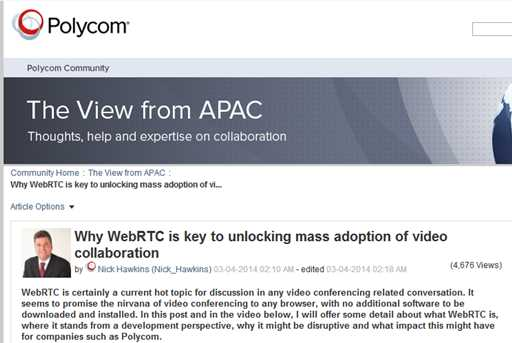
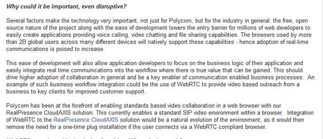

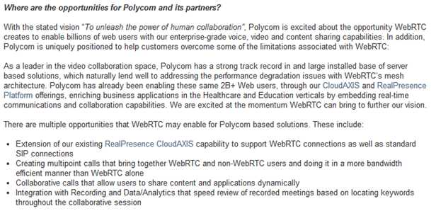

**思科(CISCO)**  

Cisco为WebRTC开源H.264. 开源项目叫openh264 http://www.openh264.org.  现已集成进WebRTC代码中。 


**华为(HUAWEI)**  

华为认为HTML5/WebRTC是基于浏览器的媒体通信技术，实现媒体交互应用。Chrome/Firefox浏览器已经支持。Vidtel基于私有协议进行了WebRTC的商用。促进融合、互通和标准化，开放和免费将降低软视频门槛，将对行业产生巨大变革影响。  华为的一些产品已使用WebRTC组件。

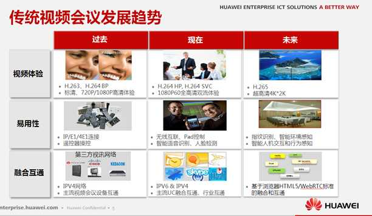

**VIDYO**    

Vidyo和Google合作共同提高WebRTC的视频质量。

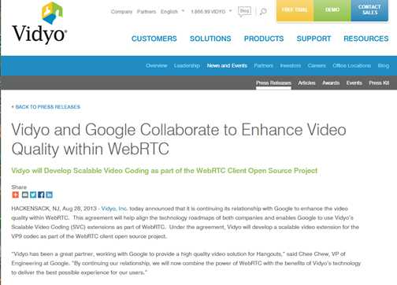

**英特尔(INTEL)**  

 [长期招聘](http://www.yingjiesheng.com/job-002-595-453.html)从事WebRTC开发的实习生。 

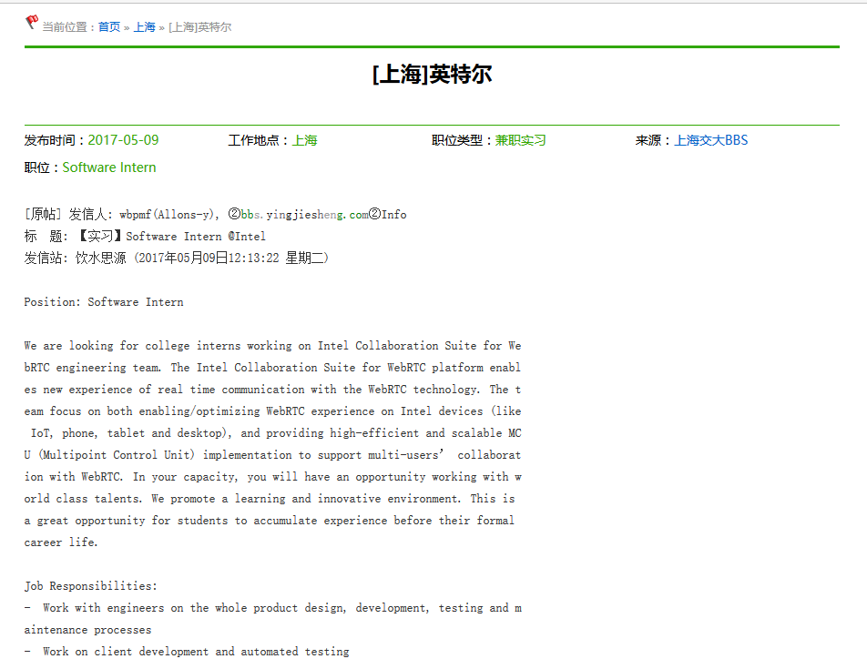

**Wainhouse**  

Wainhouse认为WebRtc是对UC的潜在破坏者。 

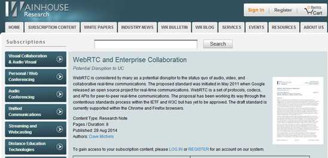  

**腾讯(Tencent)**  

 腾讯的QQ还在使用GIPS方案（WebRTC的核心源于GIPS），而微信也已大量使用WebRTC组件。

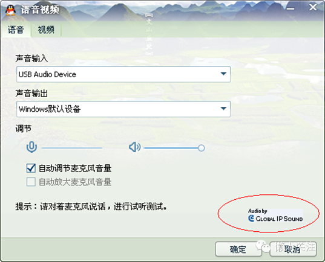

## <a name='stage-of-development'>7. WebRTC现在处于什么发展阶段？</a>

​	尽管很多人看好WebRTC，但是它有很大局限性。WebRTC是Google提供的基于Chrome浏览器的开源项目。浏览器市场被几大巨头支配，Google、Microsoft、Apple，中国国内有360。这些浏览器厂商出于利益考虑，会人为的制造技术壁垒。因此，基于WebRTC开发的项目，在浏览器适配，移动端适配上需要大量深度开发（有回答说webrtc在iphone上支持的很好，但是坑在安卓，几千种机型，各种奇葩山寨机、低端机）。WebRTC可能是潜藏的一个巨坑。


​	这里引用美国一个开发者的图来说明，WebRTC现在处在什么阶段。我们已经结束了早期探索地图、制定基本法律法规的阶段，进入了蛮荒阶段（Wild  West）。这时候，我们需要的一场大战（Civil War），来打破市场壁垒，进入改革纪元（Progressive  Era），让大战中迸发出的创新点落实成规。最终步入现代化（Modern Era）。在现代化阶段，WebRTC无所不在。

​	在目前的“蛮荒阶段”，浏览器厂商之间尚有一战。把自己的服务，依赖于一个浏览器API似乎是不大靠谱的。当然，我们有步入“现代化”   的一天。但不会是2017年，也不会是2018年。所以，想在自己的应用中提供音视频实时通信服务，要么你找一个WebRTC团队自己研发，要么找一个世界级的实时通信API专业供应商来帮你解决最棘手的问题，让你专注业务发展。

## <a name='development-trend'>8. WebRTC的发展趋势</a>

​         2016年，是互联网的一个转折点，实时互联网开始兴起，直播业站上了风口，带来了实时互联网的蓬勃发展。

- 网络通信开始在各个垂直行业有了具体的应用。音视频通信的应用不再局限于企业内部的视频会议。依赖于API经济的发展，开始应用于众多垂直行业，比如在线医疗、在线教育、呼叫中心。
- 通信类、社交类应用开始广泛接受音视频通信功能。此前，网络通信只有IM，文字、图片类的短消息。2016年，通信、社交类应用开始普遍接入音视频通信功能，这已成为标配。

WebRTC是推动实时通信行业的一个主要技术，展望未来，网络通信会是一个怎样的发展趋势？

- WebRTC应用最大的市场是：客户服务和某些垂直行业（医疗和教育行业领跑）
- 企业开始大量储备WebRTC开发人才。
- 直播在2016年增长了70%，2017年保持了强劲的增长势头，社交类的大企业会倾向在这方面投入更大的资源。
- 进入CPaaS（Communications-platform-as-a-service）市场有很多种方式，其中一种就是通过以声网http://Agora.io为代表的专门提供实时API供应商，也有其他一些基础云服务平台如腾讯，或以短信为核心产品的云通讯平台如Twilio也加入到这个行列。专门的API供应商出现极大降低了开发者对实时通信技术的使用门槛，也推动了实时通信技术在更多行业的应用，如直播连麦、游戏语音等等，当然也极大推动了实时互联网行业的快速发展，API经济将是互联网大趋势。
- 更多垂直行业将会有更多音视频通信的有趣应用场景。

  ​总有一天，WebRTC的应用技术，会变得像web开发一样普及。届时，WebRTC或者RTC API将会是web开发人员最常用的工具之一。

## <a name='core-component'>9. WebRTC 的核心组件</a>

- 音视频引擎：OPUS、VP8 / VP9、H264
- 传输层协议：底层传输协议为 UDP
- 媒体协议：SRTP / SRTCP
- 数据协议：DTLS / SCTP
- P2P 内网穿透：STUN / TURN / ICE / Trickle ICE
- 信令与 SDP 协商：HTTP / WebSocket / SIP、 Offer Answer 模型

## <a name='webrtc-structure'>10. WebRTC架构图</a>

#### 

​                                                 **WebRTC architecture (from [webrtc.org](http://www.webrtc.org/reference/architecture))**

架构图颜色标识说明：

（1）紫色部分是Web开发者API层；

（2）蓝色实线部分是面向浏览器厂商的API层（也就是红色框标内模块，也是本人专注研究的部分）;

（3）蓝色虚线部分浏览器厂商可以自定义实现。

将WebRTC架构图分解为内部结构简化图和协议栈后如下：

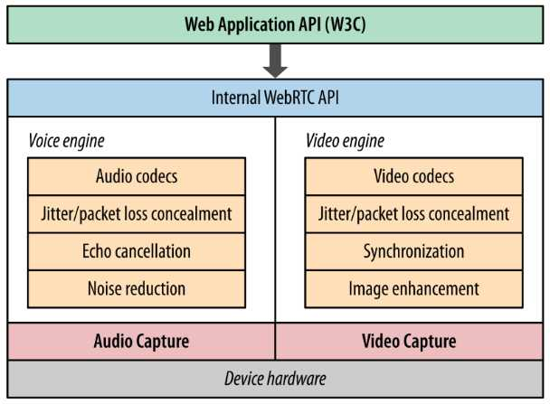

​                                                                 **△ 图1：WebRTC内部结构**


​                                                                 **△ 图2：WebRTC 协议栈**

图1为 WebRTC 内部结构简化图，最底层是硬件设备，上面是音频捕获模块和视频捕获模块。中间部分为音视频引擎。音频引擎负责音频采集和传输，具有降噪、回声消除等功能。视频引擎负责网络抖动优化，互联网传输编解码优化。在音视频引擎之上是 一套 C++ API，在 C++ 的 API 之上是提供给浏览器的Javascript API。

图2是 WebRTC 涉及到的协议栈，WebRTC 核心的协议都是在右侧基于 UDP 基础上搭建起来的。其中：

- ICE、STUN、TURN 用于内网穿透, 解决了获取与绑定外网映射地址，以及 keep alive 机制。DTLS 用于对传输内容进行加密，可以看做是 UDP 版的 TLS。由于 WebRTC 对安全比较重视，这一层是必须的。
- SRTP 与 SRTCP 是对媒体数据的封装与传输控制协议。
- SCTP 是流控制传输协议，提供类似 TCP 的特性，SCTP 可以基于 UDP 上构建，在 WebRTC 里是在 DTLS 协议之上。
- RTCPeerConnection 用来建立和维护端到端连接，并提供高效的音视频流传输。
- RTCDataChannel 用来支持端到端的任意二进制数据传输。

## <a name='component-introduction'>11. WebRTC架构组件介绍</a>

​ **(1) Your Web App**
​	Web开发者开发的程序，Web开发者可以基于集成WebRTC的浏览器提供的web API开发基于视频、音频的实时通信应用。

**(2) Web API**
​	面向第三方开发者的WebRTC标准API（Javascript），使开发者能够容易地开发出类似于网络视频聊天的web应用，最新的标准化进程可以查看[**这里**](http://dev.w3.org/2011/webrtc/editor/webrtc.html)。
**(3) WebRTC Native C++ API**
​	本地C++ API层，使浏览器厂商容易实现WebRTC标准的Web API，抽象地对数字信号过程进行处理。

**(4) Transport / Session**

​	传输/会话层，会话层组件采用了libjingle库的部分组件实现，无须使用xmpp/jingle协议

​	**a.  RTP Stack协议栈**
​	Real Time Protocol
​	**b.  STUN/ICE**
​	可以通过STUN和ICE组件来建立不同类型网络间的呼叫连接。
​	**c.  Session Management**
​	一个抽象的会话层，提供会话建立和管理功能。该层协议留给应用开发者自定义实现。

**(5) VoiceEngine**
​	音频引擎是包含一系列音频多媒体处理的框架，包括从视频采集卡到网络传输端等整个解决方案。
PS：VoiceEngine是WebRTC极具价值的技术之一，是Google收购GIPS公司后开源的。在VoIP上，技术业界领先，后面的文章会详细了解

​	**a.  iSAC**

​	Internet Speech Audio Codec

​	针对VoIP和音频流的宽带和超宽带音频编解码器，是WebRTC音频引擎的默认的编解码器
​	采样频率：16khz，24khz，32khz；（默认为16khz）
​	自适应速率为10kbit/s ~ 52kbit/；
​	自适应包大小：30~60ms；
​	算法延时：frame + 3ms

​	**b.  iLBC**
​	Internet Low Bitrate Codec
​	VoIP音频流的窄带语音编解码器
​	采样频率：8khz；
​	20ms帧比特率为15.2kbps
​	30ms帧比特率为13.33kbps
​	标准由IETF RFC3951和RFC3952定义

​	**c.  NetEQ for Voice**

​	针对音频软件实现的语音信号处理元件

​	NetEQ算法：自适应抖动控制算法以及语音包丢失隐藏算法。使其能够快速且高解析度地适应不断变化的网络环境，确保音质优美且缓冲延迟最小。是GIPS公司独步天下的技术，能够有效的处理由于网络抖动和语音包丢失时候对语音质量产生的影响。

​	PS：NetEQ 也是WebRTC中一个极具价值的技术，对于提高VoIP质量有明显效果，加以AEC\NR\AGC等模块集成使用，效果更好。

​	**d.  Acoustic Echo Canceler (AEC)**
​	回声消除器是一个基于软件的信号处理元件，能实时的去除mic采集到的回声。

​	**e.  Noise Reduction (NR)**
​	噪声抑制也是一个基于软件的信号处理元件，用于消除与相关VoIP的某些类型的背景噪声（嘶嘶声，风扇噪音等等… …）

**(6) VideoEngine**
​	WebRTC视频处理引擎
​	VideoEngine是包含一系列视频处理的整体框架，从摄像头采集视频到视频信息网络传输再到视频显示整个完整过程的解决方案。

​	**a.  VP8**
​	视频图像编解码器，是WebRTC视频引擎的默认的编解码器
​	VP8适合实时通信应用场景，因为它主要是针对低延时而设计的编解码器。
​	PS:VPx编解码器是Google收购ON2公司后开源的，VPx现在是WebM项目的一部分，而WebM项目是Google致力于推动的HTML5标准之一

​	**b.  Video Jitter Buffer**
​	视频抖动缓冲器，可以降低由于视频抖动和视频信息包丢失带来的不良影响。

​	**c.  Image enhancements**
​	图像质量增强模块
​	对网络摄像头采集到的图像进行处理，包括明暗度检测、颜色增强、降噪处理等功能，用来提升视频质量。

## <a name='web-api'>12. WebRTC浏览器API</a>

WebRTC实现了多个Web API接口，其中三个主要的Web API分别是:

- **[MediaStream](https://www.html5rocks.com/en/tutorials/webrtc/basics/#toc-mediastream)：**通过MediaStream的API能够通过设备的摄像头及话筒获得视频、音频的同步流。
- **[RTCPeerConnection](https://www.html5rocks.com/en/tutorials/webrtc/basics/#toc-rtcpeerconnection)：**RTCPeerConnection是WebRTC用于构建点对点之间稳定、高效的流传输的组件。
- **[RTCDataChannel](https://www.html5rocks.com/en/tutorials/webrtc/basics/#toc-rtcdatachannel)：**RTCDataChannel使得浏览器之间（点对点）建立一个高吞吐量、低延时的信道，用于传输任意数据。

这里大致介绍一下这三个API：

### 12.1 MediaStream (aka getUserMedia)

MediaStream API为WebRTC提供了从设备的摄像头、话筒获取视频、音频流数据的功能.

#### 12.1.1 W3C标准

详见：https://w3c.github.io/mediacapture-main/getusermedia.html

#### 12.1.2 如何调用？

可以通过`navigator.getUserMedia()`这个方法来调用，这个方法接受三个参数：

1. 一个约束对象（constraints object），这个后面会单独讲。
2. 一个调用成功的回调函数，如果调用成功，传递给它一个流对象。
3. 一个调用失败的回调函数，如果调用失败，传递给它一个错误对象。

#### 12.1.3 浏览器兼容性处理

由于浏览器实现不同，他们经常会在实现标准版本之前，在方法前面加上前缀，所以一个兼容版本就像这样：

```javascript
var getUserMedia = (navigator.getUserMedia || 
                    navigator.webkitGetUserMedia || 
                    navigator.mozGetUserMedia || 
                    navigator.msGetUserMedia);
```

#### 12.1.4 一个超级简单的例子

这里写一个超级简单的例子，用来展现getUserMedia的效果：

```html
<!DOCTYPE html>
<html>
<head>
  	<meta http-equiv="Content-Type" content="text/html; charset=utf-8" />
    <title>GetUserMedia实例</title>
</head>
<body>
    <video id="video" autoplay></video>
</body>

<script type="text/javascript">
    var getUserMedia = (navigator.getUserMedia || navigator.webkitGetUserMedia || navigator.mozGetUserMedia || navigator.msGetUserMedia);

    getUserMedia.call(navigator, {
        video: true,
        audio: true
    }, function(localMediaStream) {
        var video = document.getElementById('video');
        video.src = window.URL.createObjectURL(localMediaStream);
        video.onloadedmetadata = function(e) {
            console.log("Label: " + localMediaStream.label);
            console.log("AudioTracks" , localMediaStream.getAudioTracks());
            console.log("VideoTracks" , localMediaStream.getVideoTracks());
        };
    }, function(e) {
        console.log('Rejected!', e);
    });
 
/*  
//或：
'use strict';

navigator.getUserMedia = (navigator.getUserMedia || navigator.webkitGetUserMedia || navigator.mozGetUserMedia || navigator.msGetUserMedia);

var constraints = { // 音频、视频约束
  audio: true, // 指定请求音频Track
  video: {  // 指定请求视频Track
      mandatory: { // 对视频Track的强制约束条件
          width: {min: 320},
          height: {min: 180}
      },
      optional: [ // 对视频Track的可选约束条件
          {frameRate: 30}
      ]
  }
};

function successCallback(localMediaStream) {
  var video = document.querySelector('video');
  if (window.URL) {
    video.src = window.URL.createObjectURL(localMediaStream);
  } else {
    video.src = localMediaStream;
  }
  video.onloadedmetadata = function(e) {
            console.log("Label: " + localMediaStream.label);
            console.log("AudioTracks" , localMediaStream.getAudioTracks());
            console.log("VideoTracks" , localMediaStream.getVideoTracks());
        };
}

function errorCallback(error) {
  console.log('navigator.getUserMedia error: ', error);
}

navigator.getUserMedia(constraints, successCallback, errorCallback);
 */ 
</script>


</html>
```

将这段内容保存在一个HTML文件中，放在服务器上。用较新版本的Opera、Firefox、Chrome打开，在浏览器弹出询问是否允许访问摄像头和话筒，选同意，浏览器上就会出现摄像头所拍摄到的画面了.

注意，HTML文件要放在服务器上，否则会得到一个NavigatorUserMediaError的错误，显示PermissionDeniedError。

这里使用**getUserMedia**获得流之后，需要将其输出，一般是绑定到**video**标签上输出，需要使用**window.URL.createObjectURL(localMediaStream)**来创造能在video中使用src属性播放的Blob URL，注意在video上加入autoplay属性，否则只能捕获到一张图片。

流创建完毕后可以通过**label**属性来获得其唯一的标识，还可以通过**getAudioTracks()**和**getVideoTracks()**方法来获得流的追踪对象数组（如果没有开启某种流，它的追踪对象数组将是一个空数组）


在JS中，我们通过getUserMedia函数来处理音频和视频，该函数接收三个参数，分别是音视频的约束，成功的回调以及失败的回调。

在底层，浏览器通过音频和视频引擎对捕获的原始音频和视频流加以处理，除了对画质和音质增强之外，还得保证音频和视频的同步。

由于音频和视频是用来传输的，因此，发送方还要适应不断变化的带宽和客户端之间的网络延迟调整输出的比特率。

对于接收方来说，则必须实时解码音频和视频流，并适应网络抖动和时延。其工作原理如下图所示：

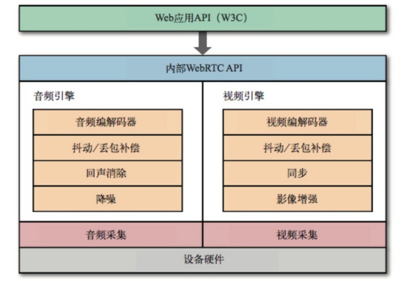

如上面源码中成功回调的localMediaStream对象中携带者一个或多个同步的Track，如果你同时在约束中设置了音频和视频为true，则在localMediaStream中会携带有音频Track和视频Track，每个Track在时间上是同步的。

localMediaStream的输出可以被发送到一或多个目的地：本地的音频或视频元素、后期处理的JavaScript代理，或者远程另一端。如下图所示：

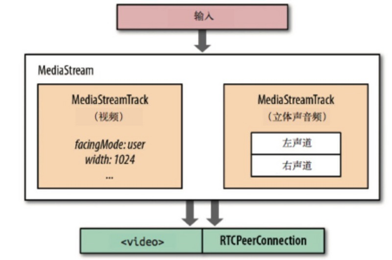

#### 12.1.5 约束对象(Constraints)

约束对象可以被设置在getUserMedia()和RTCPeerConnection的addStream方法中，这个约束对象是WebRTC用来指定接受什么样的流的，其中可以定义如下属性：

- video: 是否接受视频流
- audio：是否接受音频流
- MinWidth: 视频流的最小宽度
- MaxWidth：视频流的最大宽度
- MinHeight：视频流的最小高度
- MaxHiehgt：视频流的最大高度
- MinAspectRatio：视频流的最小宽高比
- MaxAspectRatio：视频流的最大宽高比
- MinFramerate：视频流的最小帧速率
- MaxFramerate：视频流的最大帧速率

### 12.2 RTCPeerConnection

在获取到音频和视频流后，下一步要做的就是将其发送出去。但这个跟client-server模式不同，这是client-client之间的传输，因此，在协议层面就必须解决NAT穿透问题，否则传输就无从谈起。

另外，由于WebRTC主要是用来解决实时通信的问题，可靠性并不是很重要，因此，WebRTC使用UDP作为传输层协议：低延迟和及时性才是关键。

在更深入讲解之前，我们先来思考一下，是不是只要打开音频、视频，然后发送UDP包就搞定了？

当然没那么简单，除了要解决我们上面说的NAT穿透问题之外，还需要为每个流协商参数，对用户数据进行加密，并且需要实现拥塞和流量控制。

我们来看一张WebRTC的分层协议图：

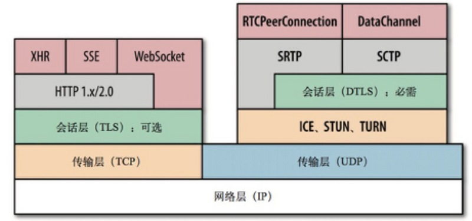

ICE、STUN和TURN是通过UDP建立并维护端到端连接所必需的；

SDP 是一种数据格式，用于端到端连接时协商参数；

DTLS用于保障传输数据的安全；

SCTP和SRTP属于应用层协议，用于在UDP之上提供不同流的多路复用、拥塞和流量控制，以及部分可靠的交付和其他服务。

ICE（Interactive Connectivity Establishment，交互连接建立）：由于端与端之间存在多层防火墙和NAT设备阻隔，因此我们需要一种机制来收集两端之间公共线路的IP，而ICE则是干这件事的好帮手。

- ICE代理向操作系统查询本地IP地址
- 如果配置了STUN服务器，ICE代理会查询外部STUN服务器，以取得本地端的公共IP和端口
- 如果配置了TURN服务器，ICE则会将TURN服务器作为一个候选项，当端到端的连接失败，数据将通过指定的中间设备转发。

WebRTC使用SDP（Session Description Protocol，会话描述协议）描述端到端连接的参数。
SDP不包含媒体本身的任何信息，仅用于描述"会话状况"，表现为一系列的连接属性：要交换的媒体类型（音频、视频及应用数据）、网络传输协议、使用的编解码器及其设置、带宽及其他元数据。

DTLS对TLS协议进行了扩展，为每条握手记录明确添加了偏移字段和序号，这样就满足了有序交付的条件，也能让大记录可以被分段成多个分组并在另一端再进行组装。
DTLS握手记录严格按照TLS协议规定的顺序传输，顺序不对就报错。最后，DTLS还要处理丢包问题：两端都是用计时器，如果预定时间没有收到应答，就重传握手记录。
为保证过程完整，两端都要生成自己签名的证书，然后按照常规的TLS握手协议走。但这样的证书不能用于验证身份，因为没有要验证的信任链。因此，在必要情况下，
应用必须自己参与各端的身份验证：

- 应用可以通过登录来验证用户
- 每一端也可以在生成SDP提议/应答时指定各自的"身份颁发机构"，等对端接收到SDP消息后，可以联系指定的身份颁发机构验证收到的证书

SRTP为通过IP网络交付音频和视频定义了标准的分组格式。SRTP本身并不对传输数据的及时性、可靠性或数据恢复提供任何保证机制，
它只负责把数字化的音频采样和视频帧用一些元数据封装起来，以辅助接收方处理这些流。

SCTP是一个传输层协议，直接在IP协议上运行，这一点跟TCP和UDP类似。不过在WebRTC这里，SCTP是在一个安全的DTLS信道中运行，而这个信道又运行在UDP之上。
由于WebRTC支持通过DataChannel API在端与端之间传输任意应用数据，而DataChannel就依赖于SCTP。


上讲了这么多，终于到我们的主角RTCPeerConnection，RTCPeerConnection接口负责维护每一个端到端连接的完整生命周期：

- RTCPeerConnection管理穿越NAT的完整ICE工作流
- RTCPeerConnection发送自动（STUN）持久化信号
- RTCPeerConnection跟踪本地流
- RTCPeerConnection跟踪远程流
- RTCPeerConnection按需触发自动流协商
- RTCPeerConnection提供必要的API，以生成连接提议，接收应答，允许我们查询连接的当前状态，等等

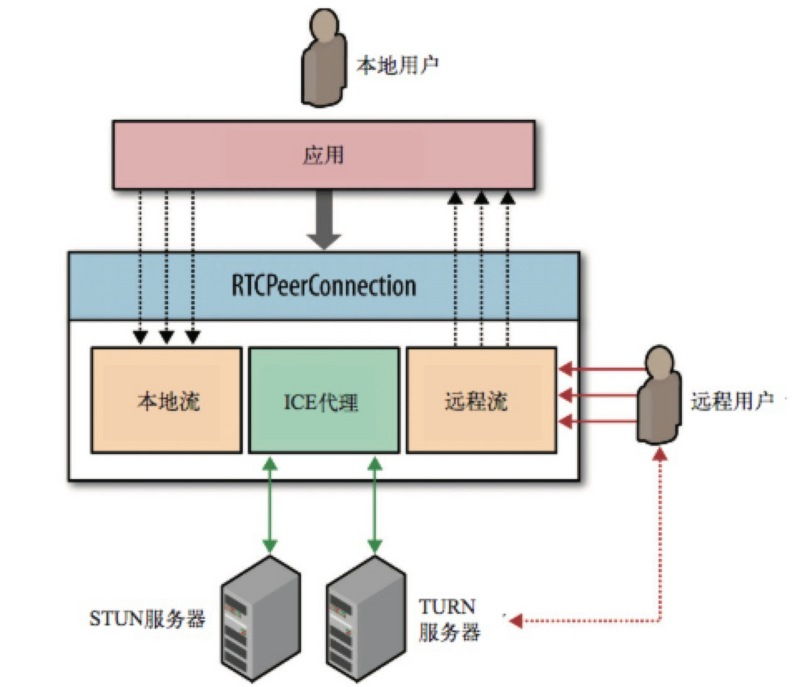

WebRTC使用RTCPeerConnection来在浏览器之间传递流数据，这个流数据通道是点对点的，不需要经过服务器进行中转。但是这并不意味着我们能抛弃服务器，我们仍然需要它来为我们传递信令（signaling）来建立这个信道。WebRTC没有定义用于建立信道的信令的协议：信令并不是RTCPeerConnection API的一部分。

既然没有定义具体的信令的协议，我们就可以选择任意方式（AJAX、WebSocket），采用任意的协议（SIP、XMPP）来传递信令，建立信道。比如可以使用node的ws模块，在WebSocket上传递信令。

#### 12.2.1 浏览器兼容处理

还是前缀不同的问题，采用和上面类似的方法：

```javascript
var PeerConnection = (window.PeerConnection ||
                    window.webkitPeerConnection00 || 
                    window.webkitRTCPeerConnection || 
                    window.mozRTCPeerConnection);
```

#### 12.2.2 创建和使用

```javascript
//使用Google的stun服务器
var iceServer = {
    "iceServers": [{
        "url": "stun:stun.l.google.com:19302"
    }]
};
//兼容浏览器的getUserMedia写法
var getUserMedia = (navigator.getUserMedia ||
                    navigator.webkitGetUserMedia || 
                    navigator.mozGetUserMedia || 
                    navigator.msGetUserMedia);
//兼容浏览器的PeerConnection写法
var PeerConnection = (window.PeerConnection ||
                    window.webkitPeerConnection00 || 
                    window.webkitRTCPeerConnection || 
                    window.mozRTCPeerConnection);
//与后台服务器的WebSocket连接
var socket = __createWebSocketChannel();
//创建PeerConnection实例
var pc = new PeerConnection(iceServer);
//发送ICE候选到其他客户端
pc.onicecandidate = function(event){
    socket.send(JSON.stringify({
        "event": "__ice_candidate",
        "data": {
            "candidate": event.candidate
        }
    }));
};
//如果检测到媒体流连接到本地，将其绑定到一个video标签上输出
pc.onaddstream = function(event){
    someVideoElement.src = URL.createObjectURL(event.stream);
};
//获取本地的媒体流，并绑定到一个video标签上输出，并且发送这个媒体流给其他客户端
getUserMedia.call(navigator, {
    "audio": true,
    "video": true
}, function(stream){
    //发送offer和answer的函数，发送本地session描述
    var sendOfferFn = function(desc){
            pc.setLocalDescription(desc);
            socket.send(JSON.stringify({ 
                "event": "__offer",
                "data": {
                    "sdp": desc
                }
            }));
        },
        sendAnswerFn = function(desc){
            pc.setLocalDescription(desc);
            socket.send(JSON.stringify({ 
                "event": "__answer",
                "data": {
                    "sdp": desc
                }
            }));
        };
    //绑定本地媒体流到video标签用于输出
    myselfVideoElement.src = URL.createObjectURL(stream);
    //向PeerConnection中加入需要发送的流
    pc.addStream(stream);
    //如果是发送方则发送一个offer信令，否则发送一个answer信令
    if(isCaller){
        pc.createOffer(sendOfferFn);
    } else {
        pc.createAnswer(sendAnswerFn);
    }
}, function(error){
    //处理媒体流创建失败错误
});
//处理到来的信令
socket.onmessage = function(event){
    var json = JSON.parse(event.data);
    //如果是一个ICE的候选，则将其加入到PeerConnection中，否则设定对方的session描述为传递过来的描述
    if( json.event === "__ice_candidate" ){
        pc.addIceCandidate(new RTCIceCandidate(json.data.candidate));
    } else {
         pc.setRemoteDescription(new RTCSessionDescription(json.data.sdp));
    }
};
```

### 12.3 RTCDataChannel

既然能建立点对点的信道来传递实时的视频、音频数据流，为什么不能用这个信道传一点其他数据呢？RTCDataChannel API就是用来干这个的，基于它我们可以在浏览器之间传输任意数据。DataChannel是建立在PeerConnection上的，不能单独使用。建立RTCPeerConnection连接之后，两端可以打开一或多个信道交换文本或二进制数据。

DataChannel和WebSocket的区别如下：


#### 12.3.1 使用DataChannel

我们可以使用`channel = pc.createDataCHannel(“someLabel”);`来在PeerConnection的实例上创建Data Channel，并给与它一个标签。

DataChannel使用方式几乎和WebSocket一样，有几个事件：

- onopen
- onclose
- onmessage
- onerror

同时它有几个状态，可以通过readyState获取：

- connecting: 浏览器之间正在试图建立channel
- open：建立成功，可以使用send方法发送数据了
- closing：浏览器正在关闭channel
- closed：channel已经被关闭了

两个暴露的方法:

- close(): 用于关闭channel
- send()：用于通过channel向对方发送数据


示例demo如下：

```javascript
var ice = {
    'iceServers': [
        {'url': 'stun:stun.l.google.com:19302'},   // google公共测试服务器
        // {"url": "turn:user@turnservera.com", "credential": "pass"}
    ]
};

// var signalingChannel =  new SignalingChannel();

var pc = new RTCPeerConnection(ice);

navigator.getUserMedia({'audio': true}, gotStream, logError);

function gotStream(stram) {
    pc.addStream(stram);

    pc.createOffer().then(function(offer){
        pc.setLocalDescription(offer);
    });
}

pc.onicecandidate = function(evt) {
    // console.log(evt);
    if(evt.target.iceGatheringState == 'complete') {
        pc.createOffer().then(function(offer){
            // console.log(offer.sdp);
            // signalingChannel.send(sdp);
        })
    }
}

function handleChannel(chan) {
    console.log(chan);
    chan.onerror = function(err) {}
    chan.onclose = function() {}
    chan.onopen = function(evt) {
        console.log('established');
        chan.send('DataChannel connection established.');
    }

    chan.onmessage = function(msg){
        // do something
    }
}

// 以合适的交付语义初始化新的DataChannel
var dc = pc.createDataChannel('namedChannel', {reliable: false});

handleChannel(dc);
pc.onDataChannel = handleChannel;

function logError(){
    console.log('error');
}
```


#### 12.3.2 通过Data Channel发送文件大致思路

JavaScript已经提供了File API从input[ type= ‘file’]的元素中提取文件，并通过**FileReader**来将文件的转换成DataURL，这也意味着我们可以将DataURL分成多个碎片来通过Channel来进行文件传输。


## <a name='signaling-server'>13. WebRTC信令交换</a>

本节讲述了WebRTC中所涉及的信令交换以及聊天室中的信令交换，主要内容来自于：[WebRTC in the real world: STUN, TURN and signaling](http://www.html5rocks.com/en/tutorials/webrtc/infrastructure/)

### 13.1 WebRTC的服务器

WebRTC提供浏览器之间的点对点信道进行数据传输，但是并不意味着WebRTC不需要服务器，建立这个信道，必须有服务器的参与。WebRTC需要服务器对其进行四方面的功能支持：

1. 用户发现以及通信；
2. 信令传输：浏览器之间交换建立通信的元数据（信令）；
3. NAT防火墙穿越；
4. 如果点对点通信建立失败，可以作为中转服务器。

### 13.2 NAT/防火墙穿越技术

#### 13.２.1 NAT简介

NAT（Network Address Translation，网络地址转换）属接入广域网(WAN)技术，是一种将私有（保留）地址转化为合法IP地址的转换技术，主要用于实现私有网络访问公共网络的功能，它被广泛应用于各种类型Internet接入方式和各种类型的网络中。原因很简单，NAT不仅完美地解决了lP地址不足的问题，而且还能够有效地避免来自网络外部的攻击，隐藏并保护网络内部的计算机。

#### 13.２.２ NAT分类

根据Stun协议(RFC3489)，NAT大致分为下面四类：

**1) Full Cone**

这种NAT内部的机器A连接过外网机器C后，NAT会打开一个端口。然后外网的任何发到这个打开的端口的UDP数据报都可以到达A，不管是不是C发过来的。

例如 A:192.168.8.100 NAT:202.100.100.100 C:292.88.88.88
A(192.168.8.100:5000) -> NAT(202.100.100.100 : 8000) -> C(292.88.88.88:2000)
任何发送到 NAT(202.100.100.100:8000)的数据都可以到达A(192.168.8.100:5000)

**2) Restricted Cone**

这种NAT内部的机器A连接过外网的机器C后，NAT打开一个端口，然后C可以用任何端口和A通信，其他的外网机器不行。

例如 A:192.168.8.100 NAT:202.100.100.100 C:292.88.88.88
A(192.168.8.100:5000) -> NAT(202.100.100.100 : 8000) -> C(292.88.88.88:2000)
任何从C发送到 NAT(202.100.100.100:8000)的数据都可以到达A(192.168.8.100:5000)

**3) Port Restricted Cone**

这种NAT内部的机器A连接过外网的机器C后，NAT打开一个端口，然后C可以用原来的端口和A通信，其他的外网机器不行。

例如 A:192.168.8.100 NAT:202.100.100.100 C:292.88.88.88
A(192.168.8.100:5000) -> NAT(202.100.100.100 : 8000) -> C(292.88.88.88:2000)
C(202.88.88.88:2000)发送到 NAT(202.100.100.100:8000)的数据都可以到达A(192.168.8.100:5000)

以上三种NAT通称Cone NAT(锥型NAT)。我们只能用这种NAT进行UDP打洞。

**4) Symmetic**

对于这种NAT连接不同的外部目标，原来NAT打开的端口会变化，而Cone NAT不会。虽然可以用端口猜测，但是成功的概率很小。因此放弃这种NAT的UDP打洞。

#### 13.２.３ UDP hole punching

对于Cone NAT，要采用UDP打洞，需要一个公网机器C来充当”介绍人”，内网的A、B先分别和C通信，打开各自的NAT端口，C这个时候知道A、B的公网IP:Port，现在A和B想直接连接，比如A给B发，除非B是Full Cone，否则不能通信。反之亦然，但是我们可以这样：

A要连接B，A给B发一个UDP包，同时同，A让那个介绍人给B发一个命令，让B同时给A发一个UDP包，这样双方的NAT都会记录对方的IP，然后就会允许互相通信。

#### 13.２.4 NAT穿越

我们目前大部分人连接互联网时都处于防火墙后面或者配置私有子网的家庭(NAT)路由器后面,这就导致我们的计算机的IP地址不是广域网IP地址,故而不能相互之间直接通讯。 正因为这样的一个场景,我们得想办法去穿越这些防火墙或者家庭(NAT)路由器，让两个同处于私有网络里的计算机能够通讯起来。建立点对点信道的一个常见问题，也就是NAT穿越技术问题，即在处于使用了NAT设备的私有TCP/IP网络中的主机之间需要建立连接时需要使用NAT穿越技术。以往在VoIP领域经常会遇到这个问题。目前已经有很多NAT穿越技术，但没有一项是完美的，因为NAT的行为是非标准化的。这些技术中大多使用了一个公共服务器，这个服务使用了一个从全球任何地方都能访问得到的IP地址。

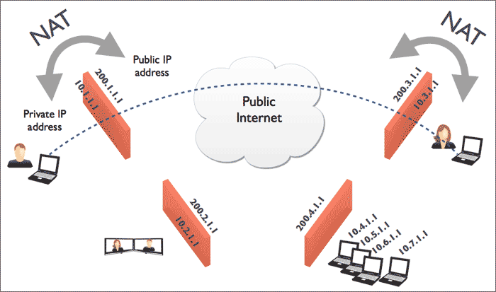

​     STUN(Simple Traversal of UDP over NATs,NAT 的UDP简单穿越)，STUN协议服务器就是用来解决这些问题:

​       1) 探测和发现通讯对方是否躲在防火墙或者NAT路由器后面。

​       2) 确定内网客户端所暴露在外的广域网的IP和端口以及NAT类型等信息;STUN服务器利用这些信息协助不同内网的计算机之间建立点对点的UDP通讯.

​       STUN协议可以很好的解决一般家用(NAT)路由器环境的打洞问题,但是对于大部分的企业的网络环境就不是很好了。

​       这时需要一个新的解决方案:TURN（Traversal Using Relay NAT，中继NAT实现的穿透）允许在TCP或UDP的连线上跨越 NAT 或防火墙。TURN是一个Client-Server协议。TURN的NAT穿透方法与STUN类似，都是通过取得应用层中的公有地址达到NAT穿透,但实现TURN client的终端必须在通讯开始前与TURN server进行交互,并要求TURN server产生"relay port", 也就是relayed-transport-address.这时 TURN server会建立peer,即远端端点（remote endpoints）, 开始进行中继（relay）的动作,TURN client利用relay port将资料传送至peer,再由peer转传到另一方的TURN client.通过服务器新产生的peer来进行数据的中转。

​        ICE就是综合前面2种协议的综合性NAT穿越解决方案。在RTCPeeConnection中，使用ICE框架来保证RTCPeerConnection能实现NAT穿越。

​	ICE，全名叫交互式连接建立（Interactive Connectivity Establishment）,一种综合性的NAT穿越技术，它是一种框架，可以整合各种NAT穿越技术如STUN、TURN。ICE会先使用STUN，尝试建立一个基于UDP的连接，如果失败了，就会去尝试TCP（先尝试HTTP，然后尝试HTTPS），如果依旧失败ICE就会使用一个中继的TURN服务器。

​	通过offer/answer模型建立基于UDP的通讯。ICE是offer/answer模型的扩展，通过在offer和answer的SDP(Session Description Protocol)里面包含多种IP地址和端口，然后对本地SDP和远程SDP里面的IP地址进行配对，然后通过P2P连通性检查进行连通性测试工作，如果测试通过即表明该传输地址对可以建立连接。其中IP地址和端口（也就是地址）有以下几种：本机地址、通过STUN服务器反射后获取的server-reflexive地址（内网地址被NAT映射后的地址）、relayed地址（和TURN转发服务器相对应的地址）及Peer reflexive地址等。

我们可以使用Google的STUN服器：**stun:stun.l.google.com:19302**，于是乎，一个整合了ICE框架的架构应该长这个样子 ：


​                                                                 **Finding connection candidates**


​                                                                           **WebRTC data pathways**


### 13.3 为什么需要信令？

我们需要通过一系列的信令来建立浏览器之间的通信。而具体需要通过信令交换哪些内容呢？这里大概列了一下：

1. 用来控制通信开启或者关闭的连接控制消息
2. 发生错误时用来彼此告知的消息
3. 媒体适配：媒体流元数据，比如像解码器、解码器的配置、带宽、媒体类型等等
4. 用来建立安全连接的关键数据
5. 网络配置：外界所看到的的网络上的数据，比如IP地址、端口等

这些信息的交换应该在点对点的流传输之前就全部完成。在建立连接之前，浏览器之间显然没有办法传递数据。所以我们需要通过服务器的中转，在浏览器之间传递这些数据，然后建立浏览器之间的点对点连接。但是WebRTC API中并没有实现这些。

### 13.4 为什么WebRTC不去实现信令交换？

不去由WebRTC实现信令交换的原因很简单：WebRTC标准的制定者们希望能够最大限度地兼容已有的成熟技术。具体的连接建立方式由一种叫JSEP（JavaScript Session Establishment Protocol）的协议来规定，使用JSEP有两个好处：

1. 在JSEP中，需要交换的关键信息是多媒体会话描述（multimedia session description）。由于开发者在其所开发的应用程序中信令所使用的协议不同（SIP或是XMPP或是开发者自己定义的协议），WebRTC建立呼叫的思想建立在媒体流控制层面上，从而与上层信令传输相分离，防止相互之间的信令污染。只要上层信令为其提供了多媒体会话描述符这样的关键信息就可以建立连接，不管开发者用何种方式来传递。


2. JSEP的架构同时也避免了在浏览器上保存连接的状态，防止其像一个状态机一样工作。由于页面经常被频繁的刷新，如果连接的状态保存在浏览器中，每次刷新都会丢失。使用JSEP能使得状态被保存在服务器上。

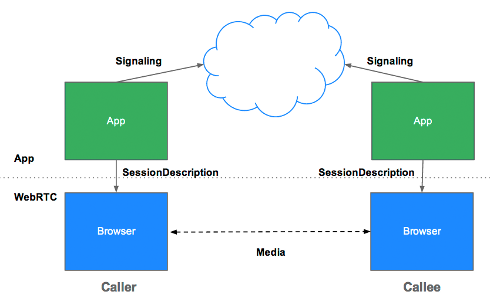

​										**JSEP architecture**


### 13.5 会话描述协议（Session Description Protocol）

JSEP将客户端之间传递的信令分为两种:offer信令和answer信令。他们主要内容的格式都遵循会话描述协议（Session Description Protocal，简称SDP）。一个SDP的信令的内容大致上如下：

```protobuf
v=0
o=- 7806956 075423448571 2 IN IP4 127.0.0.1
s=-
t=0 0
a=group:BUNDLE audio video data
a=msid-semantic: WMS 5UhOcZZB1uXtVbYAU5thB0SpkXbzk9FHo30g
m=audio 1 RTP/SAVPF 111 103 104 0 8 106 105 13 126
c=IN IP4 0.0.0.0
a=rtcp:1 IN IP4 0.0.0.0
a=ice-ufrag:grnpQ0BSTSnBLroq
a=ice-pwd:N5i4DZKMM2L7FEYnhO8V7Kg5
a=ice-options:google-ice
a=fingerprint:sha-256 01:A3:18:0E:36:5E:EF:24:18:8C:8B:0C:9E:B0:84:F6:34:E9:42:E3:0F:43:64:ED:EC:46:2C:3C:23:E3:78:7B
a=setup:actpass
a=mid:audio
a=extmap:1 urn:ietf:params:rtp-hdrext:ssrc-audio-level
a=recvonly
a=rtcp-mux
a=crypto:1 AES_CM_128_HMAC_SHA1_80 inline:qzcKu22ar1+lYah6o8ggzGcQ5obCttoOO2IzXwFV
a=rtpmap:111 opus/48000/2
a=fmtp:111 minptime=10
a=rtpmap:103 ISAC/16000
a=rtpmap:104 ISAC/32000
a=rtpmap:0 PCMU/8000
a=rtpmap:8 PCMA/8000
a=rtpmap:106 CN/32000
a=rtpmap:105 CN/16000
a=rtpmap:13 CN/8000
a=rtpmap:126 telephone-event/8000
a=maxptime:60
m=video 1 RTP/SAVPF 100 116 117
c=IN IP4 0.0.0.0
a=rtcp:1 IN IP4 0.0.0.0
a=ice-ufrag:grnpQ0BSTSnBLroq
a=ice-pwd:N5i4DZKMM2L7FEYnhO8V7Kg5
a=ice-options:google-ice
a=fingerprint:sha-256 01:A3:18:0E:36:5E:EF:24:18:8C:8B:0C:9E:B0:84:F6:34:E9:42:E3:0F:43:64:ED:EC:46:2C:3C:23:E3:78:7B
a=setup:actpass
a=mid:video
a=extmap:2 urn:ietf:params:rtp-hdrext:toffset
a=extmap:3 http://www.webrtc.org/experiments/rtp-hdrext/abs-send-time
a=sendrecv
a=rtcp-mux
a=crypto:1 AES_CM_128_HMAC_SHA1_80 inline:qzcKu22ar1+lYah6o8ggzGcQ5obCttoOO2IzXwFV
a=rtpmap:100 VP8/90000
a=rtcp-fb:100 ccm fir
a=rtcp-fb:100 nack
a=rtcp-fb:100 goog-remb
a=rtpmap:116 red/90000
a=rtpmap:117 ulpfec/90000
a=ssrc:3162115896 cname:/nERF7Ern+udqf++
a=ssrc:3162115896 msid:5UhOcZZB1uXtVbYAU5thB0SpkXbzk9FHo30g 221b204e-c9a0-4b01-b361-e17e9bf8f639
a=ssrc:3162115896 mslabel:5UhOcZZB1uXtVbYAU5thB0SpkXbzk9FHo30g
a=ssrc:3162115896 label:221b204e-c9a0-4b01-b361-e17e9bf8f639
m=application 1 DTLS/SCTP 5000
c=IN IP40.0.0.0
a=ice-ufrag:grnpQ0BSTSnBLroq
a=ice-pwd:N5i4DZKMM2L7FEYnhO8V7Kg5
a=ice-options:google-ice
a=fingerprint:sha-256 01:A3:18:0E:36:5E:EF:24:18:8C:8B:0C:9E:B0:84:F6:34:E9:42:E3:0F:43:64:ED:EC:46:2C:3C:23:E3:78:7B
a=setup:actpass
a=mid:data
a=sctpmap:5000 webrtc-datachannel 1024
```

它是一个在点对点连接中描述自己的字符串，我们可以将其封装在JSON中进行传输，在PeerConnection建立后将其通过服务器中转后，将自己的SDP描述符和对方的SDP描述符交给PeerConnection就行了。若想深入了解，可以参考[SDP for the WebRTC draft-nandakumar-rtcweb-sdp-04](http://datatracker.ietf.org/doc/draft-nandakumar-rtcweb-sdp/?include_text=1)进行解析。

### 13.6 信令与RTCPeerConnection建立

在上一章节中介绍过，WebRTC使用RTCPeerConnection来在浏览器之间传递流数据，在建立RTCPeerConnection实例之后，想要使用其建立一个点对点的信道，我们需要做两件事：

1. 确定本机上的媒体流的特性，比如分辨率、编解码能力啥的（SDP描述符）
2. 连接两端的主机的网络地址（ICE Candidate）

需要注意的是，由于连接两端的主机都可能在内网或是在防火墙之后，我们需要一种对所有联网的计算机都通用的定位方式。这其中就涉及NAT/防火墙穿越技术，以及WebRTC用来达到这个目的所ICE框架。这一部分在上一章节中有介绍，这里不再赘述。

### 13.7 通过offer和answer交换SDP描述符

大致上在两个用户（甲和乙）之间建立点对点连接流程应该是这个样子（这里不考虑错误的情况，RTCPeerConnection简称PC）：

1. 甲和乙各自建立一个PC实例
2. 甲通过PC所提供的`createOffer()`方法建立一个包含甲的SDP描述符的offer信令
3. 甲通过PC所提供的`setLocalDescription()`方法，将甲的SDP描述符交给甲的PC实例
4. 甲将offer信令通过服务器发送给乙
5. 乙将甲的offer信令中所包含的的SDP描述符提取出来，通过PC所提供的`setRemoteDescription()`方法交给乙的PC实例
6. 乙通过PC所提供的`createAnswer()`方法建立一个包含乙的SDP描述符answer信令
7. 乙通过PC所提供的`setLocalDescription()`方法，将乙的SDP描述符交给乙的PC实例
8. 乙将answer信令通过服务器发送给甲
9. 甲接收到乙的answer信令后，将其中乙的SDP描述符提取出来，调用`setRemoteDescripttion()`方法交给甲自己的PC实例

通过在这一系列的信令交换之后，甲和乙所创建的PC实例都包含甲和乙的SDP描述符了，完成了两件事的第一件。我们还需要完成第二件事——获取连接两端主机的网络地址。

### 13.8 通过ICE框架建立NAT/防火墙穿越的连接

这个网络地址应该是能从外界直接访问，WebRTC使用ICE框架来获得这个地址。RTCPeerConnection在创立的时候可以将ICE服务器的地址传递进去，如：

```javascript
var iceServer = {
    "iceServers": [{
        "url": "stun:stun.l.google.com:19302"
    }]
};
var pc = new RTCPeerConnection(iceServer);
```

当然这个地址也需要交换，还是以甲乙两位为例，交换的流程如下（RTCPeerConnection简称PC）：

1. 甲、乙各创建配置了ICE服务器的PC实例，并为其添加`onicecandidate`事件回调
2. 当网络候选可用时，将会调用`onicecandidate`函数
3. 在回调函数内部，甲或乙将网络候选的消息封装在ICE Candidate信令中，通过服务器中转，传递给对方
4. 甲或乙接收到对方通过服务器中转所发送过来ICE Candidate信令时，将其解析并获得网络候选，将其通过PC实例的`addIceCandidate()`方法加入到PC实例中

这样连接就创立完成了，可以向RTCPeerConnection中通过`addStream()`加入流来传输媒体流数据。将流加入到RTCPeerConnection实例中后，对方就可以通过`onaddstream`所绑定的回调函数监听到了。调用`addStream()`可以在连接完成之前，在连接建立之后，对方一样能监听到媒体流。

### 13.9 聊天室中的信令

上面是两个用户之间的信令交换流程，但我们需要建立一个多用户在线视频聊天的聊天室。所以需要进行一些扩展，来达到这个要求。

#### 13.9.1 用户操作

首先需要确定一个用户在聊天室中的操作大致流程：

1. 打开页面连接到服务器上
2. 进入聊天室
3. 与其他所有已在聊天室的用户建立点对点的连接，并输出在页面上
4. 若有聊天室内的其他用户离开，应得到通知，关闭与其的连接并移除其在页面中的输出
5. 若又有其他用户加入，应得到通知，建立于新加入用户的连接，并输出在页面上
6. 离开页面，关闭所有连接

从上面可以看出来，除了点对点连接的建立，还需要服务器至少做如下几件事：

1. 新用户加入房间时，发送新用户的信息给房间内的其他用户
2. 新用户加入房间时，发送房间内的其他用户信息给新加入房间的用户
3. 用户离开房间时，发送离开用户的信息给房间内的其他用户

#### 13.9.2 实现思路

以使用WebSocket为例，上面用户操作的流程可以进行以下修改：

1. 浏览器与服务器建立WebSocket连接
2. 发送一个加入聊天室的信令（join），信令中需要包含用户所进入的聊天室名称
3. 服务器根据用户所加入的房间，发送一个其他用户信令（peers），信令中包含聊天室中其他用户的信息，浏览器根据信息来逐个构建与其他用户的点对点连接
4. 若有用户离开，服务器发送一个用户离开信令（remove_peer），信令中包含离开的用户的信息，浏览器根据信息关闭与离开用户的信息，并作相应的清除操作
5. 若有新用户加入，服务器发送一个用户加入信令（new_peer），信令中包含新加入的用户的信息，浏览器根据信息来建立与这个新用户的点对点连接
6. 用户离开页面，关闭WebSocket连接

#### 13.9.3 服务器实现

由于用户可以只是建立连接，可能还没有进入具体房间，所以首先我们需要一个容器来保存所有用户的连接，同时监听用户是否与服务器建立了WebSocket的连接：

```javascript
var server = new WebSocketServer();
var sockets = [];

server.on('connection', function(socket){
    socket.on('close', function(){
        var i = sockets.indexOf(socket);
        sockets.splice(i, 1);
        //关闭连接后的其他操作
    });
    sockets.push(socket);
    //连接建立后的其他操作
});
```

由于有房间的划分，所以我们需要在服务器上建立一个容器，用来保存房间内的用户信息。显然对象较为合适，键为房间名称，值为用户信息列表。

同时我们需要监听上面所说的用户加入房间的信令（join），新用户加入之后需要向新用户发送房间内其他用户信息（peers）和向房间内其他用户发送新用户信息（new_peer），以及用户离开时向其他用户发送离开用户的信息（remove_peer）:

于是乎代码大致就变成这样：

```javascript
var server = new WebSocketServer();
var sockets = [];
var rooms = {};

/*
join信令所接收的格式
{
    "eventName": "join",
    "data": {
        "room": "roomName"
    }
}
*/
var joinRoom = function(data, socket) {
    var room = data.room || "__default";
    var curRoomSockets; //当前房间的socket列表
    var socketIds = []; //房间其他用户的id

    curRoomSockets = rooms[room] = rooms[room] || [];

    //给所有房间内的其他人发送新用户的id
    for (var i = curRoomSockets.length; i--;) {
        socketIds.push(curRoomSockets[i].id);
        curRoomSockets[i].send(JSON.stringify({
            "eventName": "new_peer",
            "data": {
                "socketId": socket.id
            }
        }));
    }

    //将新用户的连接加入到房间的连接列表中
    curRoomSockets.push(socket);
    socket.room = room;

    //给新用户发送其他用户的信息，及服务器给新用户自己赋予的id
    socket.send(JSON.stringify({
        "eventName": "peers",
        "data": {
            "socketIds": socketIds,
            "you": socket.id
        }
    }));
};

server.on('connection', function(socket) {
    //为socket构建一个特有的id，用来作为区分用户的标记
    socket.id = getRandomString();
    //用户关闭连接后，应做的处理
    socket.on('close', function() {
        var i = sockets.indexOf(socket);
        var room = socket.room;
        var curRoomSockets = rooms[room];
        sockets.splice(i, 1);
        //通知房间内其他用户
        if (curRoomSockets) {
            for (i = curRoomSockets.length; i--;) {
                curRoomSockets[i].send(JSON.stringify({
                    "eventName": "remove_peer",
                    "data": {
                        "socketId": socket.id
                    }
                }));
            }
        }
        //从room中删除socket
        if (room) {
            i = this.rooms[room].indexOf(socket);
            this.rooms[room].splice(i, 1);
            if (this.rooms[room].length === 0) {
                delete this.rooms[room];
            }
        }
        //关闭连接后的其他操作
    });
    //根据前台页面传递过来的信令进行解析，确定应该如何处理
    socket.on('message', function(data) {
        var json = JSON.parse(data);
        if (json.eventName) {
            if (json.eventName === "join") {
                joinRoom(data, socket);
            }
        }
    });
    //将连接保存
    sockets.push(socket);
    //连接建立后的其他操作
});
```

最后再加上点对点的信令转发就行了，一份完整的代码可参考[SkyRTC项目源码](https://github.com/LingyuCoder/SkyRTC/blob/master/SkyRTC.js)


## <a name='peer-to-peer'>14. WebRTC点对点通信</a>

WebRTC给我们带来了浏览器中的视频、音频聊天体验。但个人认为，它最实用的特性莫过于DataChannel——在浏览器之间建立一个点对点的数据通道。在DataChannel之前，浏览器到浏览器的数据传递通常是这样一个流程：浏览器A发送数据给服务器，服务器处理，服务器再转发给浏览器B。这三个过程都会带来相应的消耗，占用服务器带宽不说，还减缓了消息从发送到接收的时间。其实最理想的方式就是浏览器A直接与浏览B进行通信，服务器不需要参与其中。WebRTC DataChannel就提供了这样一种方式。当然服务器完全不参与其中，显然是不可能的，用户需要通过服务器上存储的信息，才能确定需要和谁建立连接。这里通过一个故事来讲述建立连接的过程：

####14.1 DataChannel连接的建立

**故事一：老刘和老姚去钓鱼**

背景：

- 老刘和老姚都住在同一个小区但不同的片区，小区很破旧，没有电话
- 片区相互隔离且片区门口有个保安，保安只认识自己片区的人，遇到不认识的人就需要查询凭证才能通过，而凭证需要找物业才能确定
- 门卫老大爷认识小区里的所有人但是不知道都住哪，有什么消息都可以在出入小区的时候代为传达

现在，老刘听说老姚钓鱼技术高超，想和老姚讨论钓鱼技巧。只要老刘和老姚相互之间知道对方的门牌号以及凭证，就可以串门了:

1. 门卫老大爷认识老刘和老姚
2. 老刘找物业确定了自己片区的出入凭证，将凭证、自己的门牌号以及意图告诉门卫老大爷，让其转交给老姚
3. 老姚买菜归来遇到门卫老大爷，门卫老大爷将老刘的消息传达给老姚。于是老姚知道怎么去老刘家了
4. 老姚很开心，他也找物业获取了自己小区的凭证，并将凭证、自己的门牌号等信息交给门卫老大爷，希望他传达给老刘
5. 老刘吃早餐回来遇到门卫老大爷，老大爷把老姚的小区凭证、门牌号等信息告诉老刘，这样老刘就知道了怎么去老姚家了

老刘和老姚相互之间知道了对方的门牌号和小区出入凭证，他们相互之间有什么需要交流的直接串门就行了，消息不再需要门卫老大爷来代为传达了

**换个角度**

我们把角色做一个映射：

- 老刘：浏览器A
- 老姚：浏览器B
- 片区：不同网段
- 保安：防火墙
- 片区凭证：ICE candidate
- 物业：ICE server
- 门牌号：session description
- 门卫老大爷：server

于是乎故事就变成了这样：

1. 浏览器A和浏览器B在server上注册，并保有连接
2. 浏览器A从ice server获取ice candidate并发送给server，并生成包含session description的offer，发送给server
3. server发送浏览器A的offer和ice candidate给浏览器B
4. 浏览器B发送包含session description的answer和ice candidate给server
5. server发送浏览器B的answer和ice candidate给浏览器A

这样，就建立了一个点对点的信道，流程如下所示：


#### 14.2 DataChannel的分片传输

**故事二：老姚送礼物**

老刘和老姚已经可以相互串门了，经过一段时间的交流感情越来越深。老姚的亲友送了20斤葡萄给老姚，老姚决定送10斤给老刘。老姚毕竟年事已高，不可能一次带10斤。于是乎，老姚将葡萄分成了10份，每次去老刘家串门就送一份过去。

这里可以做如下类比：

1. 10斤葡萄：一个文件（尽管文件分片没有意义，葡萄分开还可以单独吃，但是实在找不到啥好的比喻了）
2. 分成10份：将文件分片，转成多个chunk
3. 老姚一次只能带一斤：datachannel每次传输的数据量不宜太大（[找到最合适的大小](http://stackoverflow.com/questions/15435121/what-is-the-maximum-size-of-webrtc-data-channel-messages)）

这其实就是通过datachannel传输文件的方式，首先将文件分片，然后逐个发送，最后再统一的进行组合成一个新的文件

**分片**

通过HTML5的File API可以将type为file的input选中的文件读取出来，并转换成data url字符串。这也就为我们提供了很方便的分片方式：

```javascript
var reader = new window.FileReader(file);
reader.readAsDataURL(file);
reader.onload = function(event, text) {
    chunkify(event.target.result);//将数据分片
};
```

**组合**

通过datachannel发送的分片数据，我们需要将其进行组合，由于是data url字符串，在接收到所有包之后进行拼接就可以了。拼接完成后就得到了一个文件完整的data url字符串，那么我们如何将这个字符串转换成文件呢？

方案一：直接跳转下载

既然是个dataurl，我们直接将其赋值给window.location.href自然可以下载，但是这样下载是没法设定下载后的文件名的，这想一想都蛋疼

方案二：通过a标签下载

这个原理和跳转下载类似，都是使用dataurl本身的特性，通过创建一个a标签，将dataurl字符串赋值给href属性，然后使用download确定下载后的文件名，就可以完成下载了。但是很快又有新问题了，稍微大一点的文件下载的时候页面崩溃了。这是因为dataurl有大小限制

方案三：blob

其实可以通过给a标签创建blob url的方式来进行下载，这个没有大小限制。但是我们手上是dataurl，所以需要先进行转换：

```javascript
function dataURItoBlob(dataURI, dataTYPE) {
    var binary = atob(dataURI.split(',')[1]),
        array = [];
    for (var i = 0; i < binary.length; i++) array.push(binary.charCodeAt(i));
    return new Blob([new Uint8Array(array)], {
        type: dataTYPE
    });
}
```

获得blob后，我们就可以通过URL API来下载了：

```javascript
var a = document.createElement("a");
document.body.appendChild(a);
a.style = "display: none";
var blob = dataURItoBlob(data, 'octet/stream');
var url = window.URL.createObjectURL(blob);
a.href = url;
a.download = filename;
a.click();
!moz && window.URL.revokeObjectURL(url);
a.parentNode.removeChild(a);
```

这里有几个点：

1. datachannel其实是可以直接传送blob的，但是只有firefox支持，所以传data url
2. chrome下载是直接触发的，不会进行询问，firefox会先询问后下载，在询问过程中如果执行了revokeObjectURL，下载就会取消。


#### 14.3 DataChannel传输的升级

如我们所知，WebRTC最有特点的地方其实是可以传输getUserMedia获得的视频、音频流，来实现视频聊天。但事实上我们的使用习惯来看，一般人不会一开始就打开视频聊天，而且视频聊天时很消耗内存的（32位机上一个连接至少20M左右好像，也有可能有出入）。所以常见的需求是，先建立一个包含datachannel的连接用于传输数据，然后在需要时升级成可以传输视频、音频。

看看我们之前传输的session description，它其实来自[Session Description Protocol](http://datatracker.ietf.org/doc/draft-nandakumar-rtcweb-sdp/?include_text=1)。可以看到wiki上的介绍：

> The Session Description Protocol (SDP) is a format for describing streaming media initialization parameters.

这意味着什么呢？我们之前建立datachannel是没有加视频、音频流的，而这个流的描述是写在SDP里面的。现在我们需要传输视频、音频，就需要添加这些描述。所以就得重新获得SDP，然后构建offer和answer再传输一次。传输的流程和之前一样，没什么区别。但这一次，我们不需要传输任何的ice candidate。

> from mattm: You do not need to send ICE candidates on an already established peer connection. The ICE candidates are to make sure the two peers can establish a connection through their potential NAT and firewalls. If you can already send data on the peer connection, ICE candidates will not do anything.

****


## <a name='core-module-api'>15. WebRTC核心模块API</a>

### 15.1 网络传输模块：libjingle

WebRTC重用了libjingle的一些组件，主要是network和transport组件，关于libjingle的文档资料可以查看[**这里**](http://code.google.com/apis/talk/libjingle/developer_guide.html)。

### 15.2 音频、视频图像处理的主要数据结构

**常量\VideoEngine\VoiceEngine**

*注意：以下所有的方法、类、结构体、枚举常量等都在webrtc命名空间里*

| **类、结构体、枚举常量**        | **头文件**        | **说明**                                   |
| --------------------- | -------------- | ---------------------------------------- |
| **Structures**        | common_types.h | Lists the structures common to the VoiceEngine & VideoEngine |
| **Enumerators**       | common_types.h | List the enumerators common to the  VoiceEngine & VideoEngine |
| **Classes**           | common_types.h | List the classes common to VoiceEngine & VideoEngine |
| class **VoiceEngine** | voe_base.h     | How to allocate and release resources for the VoiceEngine using factory methods in the VoiceEngine class. It also lists the APIs which are required to enable file tracing and/or traces as callback messages |
| class **VideoEngine** | vie_base.h     | How to allocate and release resources for the VideoEngine using factory methods in the VideoEngine class. It also lists the APIs which are required to enable file tracing and/or traces as callback messages |

### 15.3 音频引擎（VoiceEngine）模块 APIs

*下表列的是目前在 VoiceEngine中可用的sub APIs*

| **sub-API**            | **头文件**                | **说明**                                   |
| ---------------------- | ---------------------- | ---------------------------------------- |
| **VoEAudioProcessing** | voe_audio_processing.h | Adds support for Noise Suppression (NS), Automatic Gain Control (AGC) and Echo Control (EC). Receiving side VAD is also included. |
| **VoEBase**            | voe_base.h             | Enables full duplex VoIP using G.711.**NOTE:** This API must always be created. |
| **VoECallReport**      | voe_call_report.h      | Adds support for call reports which contains number of dead-or-alive detections, RTT measurements, and Echo metrics. |
| **VoECodec**           | voe_codec.h            | Adds non-default codecs (e.g. iLBC, iSAC, G.722 etc.), Voice Activity Detection (VAD) support. |
| **VoEDTMF**            | voe_dtmf.h             | Adds telephone event transmission, DTMF tone generation and telephone event detection. (Telephone events include DTMF.) |
| **VoEEncryption**      | voe_encryption.h       | Adds external encryption/decryption support. |
| **VoEErrors**          | voe_errors.h           | Error Codes for the VoiceEngine          |
| **VoEExternalMedia**   | voe_external_media.h   | Adds support for external media processing and enables utilization of an external audio resource. |
| **VoEFile**            | voe_file.h             | Adds file playback, file recording and file conversion functions. |
| **VoEHardware**        | voe_hardware.h         | Adds sound device handling, CPU load monitoring and device information functions. |
| **VoENetEqStats**      | voe_neteq_stats.h      | Adds buffer statistics functions.        |
| **VoENetwork**         | voe_network.h          | Adds external transport, port and address filtering, Windows QoS support and packet timeout notifications. |
| **VoERTP_RTCP**        | voe_rtp_rtcp.h         | Adds support for RTCP sender reports, SSRC handling, RTP/RTCP statistics, Forward Error Correction (FEC), RTCP APP, RTP capturing and RTP keepalive. |
| **VoEVideoSync**       | voe_video_sync.h       | Adds RTP header modification support, playout-delay tuning and monitoring. |
| **VoEVolumeControl**   | voe_volume_control.h   | Adds speaker volume controls, microphone volume controls, mute support, and additional stereo scaling methods. |

### 15.4 视频引擎（VideoEngine）模块 APIs

*下表列的是目前在 VideoEngine中可用的sub APIs*

| **sub-API**          | **头文件**              | **说明**                                   |
| -------------------- | -------------------- | ---------------------------------------- |
| **ViEBase**          | vie_base.h           | Basic functionality for creating a VideoEngine instance, channels and VoiceEngine interaction.**NOTE:** This API must always be created. |
| **ViECapture**       | vie_capture.h        | Adds support for capture device allocation as well as capture device capabilities. |
| **ViECodec**         | vie_codec.h          | Adds non-default codecs, codec settings and packet loss functionality. |
| **ViEEncryption**    | vie_encryption.h     | Adds external encryption/decryption support. |
| **ViEErrors**        | vie_errors.h         | Error codes for the VideoEngine          |
| **ViEExternalCodec** | vie_external_codec.h | Adds support for using external codecs.  |
| **ViEFile**          | vie_file.h           | Adds support for file recording, file playout, background images and snapshot. |
| **ViEImageProcess**  | vie_image_process.h  | Adds effect filters, deflickering, denoising and color enhancement. |
| **ViENetwork**       | vie_network.h        | Adds send and receive functionality, external transport, port and address filtering, Windows QoS support, packet timeout notification and changes to network settings. |
| **ViERender**        | vie_render.h         | Adds rendering functionality.            |
| **ViERTP_RTCP**      | vie_rtp_rtcp.h       | Adds support for RTCP reports, SSRS handling RTP/RTCP statistics, NACK/FEC, keep-alive functionality and key frame request methods. |


## <a name='multi-party-conversation'>16. WebRTC实现多方会话</a>

实时音视频有两种会话方式，一种是点对点的，就是2个设备之间进行交流。就像2个人视频聊天这种场景的。另外一种是多方会话，就像视频会议这样的场景。

#### 16.1 WebRTC适合做视频直播或音视频会议吗？

先说结论：**完全可以！**

但是，凡事总有但是，**也没那么简单**。你以为调用几个Chrome的API就能直播了？too simple

那正确的方法是什么呢？

1. 你得有一个实现了WebRTC相关协议的客户端。比如Chrome浏览器。
2. 架设一个类似MCU系统的服务器。（不知道MCU是什么？看这：[MCU（视频会议系统中心控制设备）](https://baike.baidu.com/item/MCU/3248422#viewPageContent)）

第一步，用你的客户端，比如Chrome浏览器，通过WebRTC相关的媒体API获取图像及声音信源，再用WebRTC中的通信API将图像和声音数据发送到MCU服务器。如果你只是做着玩玩，完全可以直接用Chrome浏览器做你的直播客户端。把摄像头麦克风连上电脑之后，Chrome可以用相关的js的API获取到摄像头和麦克风的数据。缺点就是如果长时间直播，Chrome的稳定性堪忧，因为chrome这样运行24小时以上内存占用很厉害，而且容易崩溃。
第二步，MCU服务器根据你的需求对图像和声音数据进行必要的处理，比如压缩、混音等。你可能要问，WebRTC可以直接在浏览器之间P2P地传输流，为什么还要有中转的MCU服务器？因为Chrome的功能很弱，视频的分辨率控制、多路语音的混音都做不了，所以需要MCU参与。最重要的是，Chrome同时给6个客户端发视频流就很消耗资源了，所以你如果有超过10个用户收看的话，Chrome很容易崩溃。
第三步，需要看直播的用户，通过他们的Chrome浏览器，链接上你的MCU服务器，并收取服务器转发来的图像和声音流。

所以，**这就要看你用的客户端是什么**。如果你是想用浏览器，那WebRTC不是好方案。但如果你是用app，可以肯定回答：可以，而且强烈建议你基于WebRTC。

WebRTC使web浏览器通过简单的JavaScript api接口实现实时通信功能。在这方面基本已成事实上标准，正如上面写的，它成为标准不是新闻，不成为标准才是新闻。国内就有不少从事和WebRTC相关的开发者，像有的公司就基于WebRTC包做些修改、然后给其它开发者用、号称是视频聊天SDK。这样公司好多，但真正做大却有点难。我想有两个原因：Javascript的限制，浏览器的限制。

Javascript的限制。Javascript是脚本语言，能有什么功能取决于实现它的虚拟机，也就是浏览器这个应用程序。由于受限，问题来了，人民群众的需求总是琳琅满目，你都能提供吗？举个例子，直播过程中，要让对方的头上自动加顶红帽子，——当然，修改浏览器代码让加个帽子不是难事，可谁又知道接下会发生什么，难道要一个改一个？聊天往往是娱乐，娱乐经常是没啥规矩。由于这限制，开发者用它时会有这看法：东西是很好，但总是有那么点不足，而且即使是努力了也不可能解决（自个写浏览器除外）。

浏览器的限制。这就要涉及到聊天场景。很现实问题，如果我想和你聊天，身边有手机，你认为会用浏览器吗？对PC，网页比app方便，而移动设备却有点反着来，而且将来移动设备会越来越多。关于这个再深入个问题：如果PC用浏览器，手机用app，聊天是否可行？技术实现上没问题，可事实上基本不会做，代价太高划不来。浏览器时，信令走的是Websocket，app用Websocket纯粹是没事找抽，直接C Socket既简单又高效。浏览器时，两socket间没啥心跳包机制，app时心跳包机制可很大提升效率。浏览器时，由于用Javascript开发，功能受限，app时用Native Code，自个想要什么就能实现什么。而且，WebRTC是跨平台包，基于C/C++的跨平台SDK也不是没有，何不在开发时顺便开发出个Windows平台app。以上导致了app不太可能和网页聊天，这又让浏览器少去很多应用场景。

综合来说，在浏览器不是WebRTC不行，而是其它原因导致有那么点尴尬。想做一个“完美”用户体验的聊天工具，终归还得用app。

为什么说对App是完全可行呢？浏览器在用的WebRTC其实分两层，底层是个用C++写的库（Native Code），然后上层写个Javascript封装，以便供HTML5调用。既然是写app，那完全不用管上层Js封装，而且Google在开发WebRTC时已考虑用在app，底层C++库的API已做得很完善了。也就是说，一旦直接用Native Code，完全和浏览器无关了，作为C/C++开发者，他就可以用WebRTC去实现自个想实现的所有东西。

对直播使用场景，很多人是用移动设备，移动设备基本都是用app。而WebRTC中的Native Code部分跨平台特性很好，基本不用改，就能写出完全跨iOS、Android、Windows平台的代码，所以有了iOS/Android app，基本不耗成本Windows上的app就出来了。——当然，如果有人在Windows还是坚持要用浏览器，那只能说在Windows不得不留有瑕疵。

为什么有人一想到Windows，直观就认为只有p2p？我猜是和默认的信令服务器是p2p有关。关于这默认的信令服务器是怎么个交互流程，如下图所示：

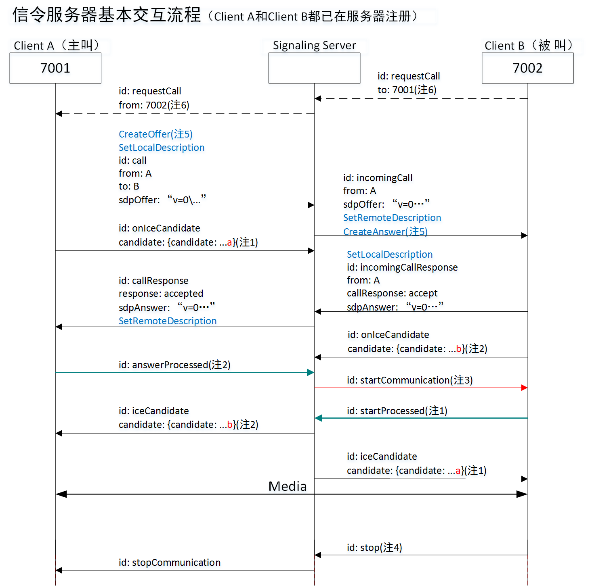

根据这个图，你可以发现，只要换了信令服务器，就有可能变成直播。而事实也的确是这样。就像有人说直播时图像单向就够了（主播传向观众），而WebRTC是双向，只要改信令服务器，立刻就单向了。 

为什么强烈建议你基于WebRTC？对直播系统，难的不是服务器，而是客户端。客户端难的地方则主要体现在两个方面，一是网络传输有关，像侦听事件，同步主线程和读线程，穿透；二是流数据有关，像编码、解码、回声消除。而这些正是WebRTC帮你解决了。也正因为如此，现在很多直播系统最早的客户端其实是以WebRTC为根的，只是后面自个不断优化，慢慢地变成自个系统而已。诚然，官方WebRTC是有地方不尽如意，但它们不断更新。

也就是说：

1. WebRTC整体的技术并不适合做直播。WebRTC设计的初衷只是为了在两个浏览器/native app之间解决直接连接发送media streaming/data数据的，也就是所谓的peer to peer的通信，大多数的情况下不需要依赖于服务器的中转，因此一般在通信的逻辑上是一对一。而我们现在的直播服务大部分的情况下是一对多的通信，一个主播可能会有成千上万个接收端，这种方式用传统的P2P来实现是不可能的，所以目前直播的方案基本上都是会有直播服务器来做中央管理，主播的数据首先发送给直播服务器，直播服务器为了能够支持非常多用户的同事观看，还要通过边缘节点CDN的方式来做地域加速，所有的接收端都不会直接连接主播，而是从服务器上接收数据。
2. WebRTC内部包含的技术模块是非常适合解决直播过程中存在的各种问题的，而且应该在大多数直播技术框架中都已经得到了部分应用，例如音视频数据的收发、音频处理回音消除降噪等。

所以综上，可以使用WebRTC内部的技术模块来解决直播过程中存在的技术问题，但是不适合直接用WebRTC来实现直播的整体框架：

#### 16.2 多方会话实现方式

WebRTC针对这多方会话提供了两种实现方式。

**第一种实现方式：实现多个浏览器之间的对等连接——全网状模型**

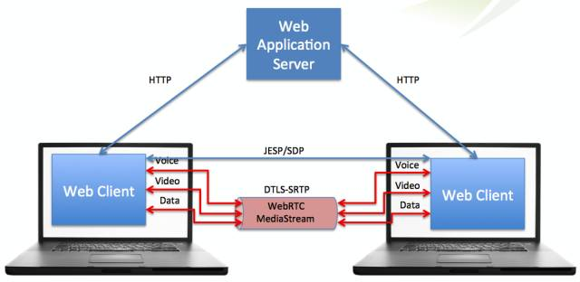

多个浏览器通过Web服务器访问网站，浏览器之间的通话并不通过任何流媒体服务器，而是直接通过对等连接，通过UDP来实现浏览器之间的通信。这个叫做全网状模型。

**第二种实现方式：浏览器和媒体服务器建立对等连接——集中式模型**
服务端除了Web服务器之外还需要架构一个台媒体服务器，媒体服务器和各个浏览器之间实现对点连接。架设媒体服务器的目的在于接收各个浏览器的媒体流六，之后通过媒体服务器把媒体流发给各个浏览器。

**两种实现方式的利弊：**
全网状：不需要架设媒体服务器，媒体延迟低质量高。但是如果人数很多的话就会导致浏览器的本地宽带增加，不适合多人会议。

集中式：比较适合多人会话，节省本地宽带，但是只有少量浏览器查询的时候，这种体系的效率非常低（因为要走媒体服务器）。

## <a name='Links'>17. 有用的链接</a>

### 17. 1 Specifications:
* WebRTC 1.0: Real-time Communication Between Browsers：https://www.w3.org/TR/webrtc/
* Media Capture and Streams：https://w3c.github.io/mediacapture-main/
* Media Capture from DOM Elements：https://w3c.github.io/mediacapture-fromelement/

### 17. 2 Getting started:
WebRTC官方网站：https://webrtc.org/start/

A Study of WebRTC Security：http://webrtc-security.github.io/

### 17. 3 Tutorials:
https://www.html5rocks.com/en/tutorials/webrtc/basics/

### 17. 4  WebRTC API:
https://developer.mozilla.org/zh-CN/docs/Web/API/WebRTC_API

### 17. 5  WebRTC codelab:
A step-by-step guide that explains how to build a complete video chat app, including a simple signaling server.  https://www.bitbucket.org/webrtc/codelab

### 17. 6 Javascript frameworks
1. Video chat:
  * https://github.com/andyet/SimpleWebRTC
  * https://github.com/priologic/easyrtc
  * https://github.com/webRTC-io/webRTC.io

2. Peer-to-peer data:
  * http://peerjs.com/
  * https://github.com/peer5/sharefest

### 17. 7 Demos:
https://webrtc.github.io/samples/

https://www.webrtc-experiment.com/

https://webcamtoy.com/zh/app/

https://idevelop.ro/ascii-camera/

### 17. 8 WebRTC教程:

1. WebRTC基础:

   - [*Scaledrone*](https://www.scaledrone.com/blog/posts/webrtc-tutorial-simple-video-chat)—这个简单的教程会教你：

     ```
     1) WebRTC基础知识
     2) 如何建立一个1对1视频通话
     3) 如何使用Scaledrone进行信令传输，这样就不需要编写服务器代码了
     ```

   - [*CodeLabs*](https://codelabs.developers.google.com/codelabs/webrtc-web/#0)—这个教程包括了WebRTC介绍，一些简单的代码和demo。

   - [*Tutorial’s Point*](https://www.tutorialspoint.com/webrtc/index.htm)—这篇教程会帮助所有想要学习如何搭建像实时广告，多人游戏，直播互动，网上学习这些应用的开发人员。

   - [*WebRTC.ventures*](https://webrtc.ventures/webrtc-resources/) Email课程—在这一系列的免费邮件中，你会学到WebRTC的基本知识，以及它的优缺点及使用方法。包括这些话题：

     ```
     1) WebRTC基础
     2) WebRTC优点
     3) WebRTC缺点
     4) 信令
     5) 建立WebRTC通话
     6) WebRTC中的DataChannel
     7) WebRTC设计
     ```

   - [*Verto*](http://evoluxbr.github.io/verto-docs/)—在这个教程中，我们会通过例子学到如何建立，调入verto jQuery库来创建一个基础的网络视频会议应用。

2. CPASS教程:

   - [*Tokbox*](https://tokbox.com/developer/tutorials/)—这是教程会一步一步指导你建立自己的OpenTok实时视频软件中的内容。在完成基本教程之后，你就可以继续跟着Tokbox的教程学习进阶内容：

   ```
   1) 归档
   2) 文字聊天
   3) 自定义视频渲染
   4) 自定义音频驱动
   5) 以及更多内容
   ```

   - [*Twilio*](https://www.twilio.com/docs/tutorials/browser-calls-node-express)—这个网页应用会向你展示如何使用Twilio客户端来创建一个浏览器-手机以及浏览器-浏览器通话。
   - [*Vidyo.io*](https://support.vidyo.io/hc/en-us/sections/115001457187-Video-Tutorials)—Vidyo.io通过教育视频聊天教程向我们展示：

   ```
   1) 生成Vidyo.io Token
   2) 用几分钟的时间就搭建一个iOS版的移动端视频聊天软件
   3) 用几分钟的时间就搭建一个Android版的移动端视频聊天软件
   ```

3. **信令**

   [*Html5Rocks.com*](https://www.html5rocks.com/en/tutorials/webrtc/infrastructure/)—在这个教程文章中，你会学到如何搭建一个信令服务，以及如何通过使用STUN和TURN服务器来处理现实世界中连接性产生的各种奇怪问题。还解释了WebRTC应用是如何处理多方通话以及与VoIP和PSTN这些服务互动的。

4. **媒体服务器**

   [*Kurento教程*](http://doc-kurento.readthedocs.io/en/stable/tutorials.html)—这些教程会给你展示如何使用Kurento框架搭建不同种类的WebRTC及多媒体应用。教程从三个角度出发：Java，浏览器JavaScript和Node.js。

### 17. 9 WebRTC服务提供商:
1. 国外:
  * https://xirsys.com
  * https://tokbox.com/developer/
  * https://cloud.aculab.com/documents/webrtcdemo
  * https://www.twilio.com/webrtc
  * http://www.frafos.com/webrtc/
  * http://www.sightcall.com/
2. 国内:
  * 声网：https://www.agora.io/cn/
  * 融云：http://www.rongcloud.cn/
  * 亲加云：http://www.gotye.com.cn/
  * 环信：https://www.easemob.com/
  * 野狗通信云：https://www.wilddog.com/

