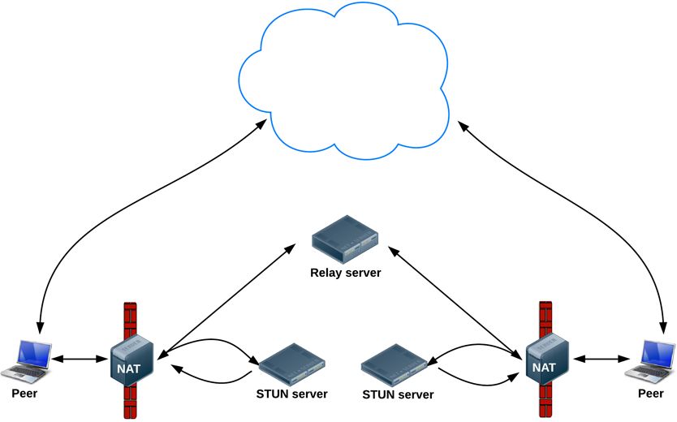
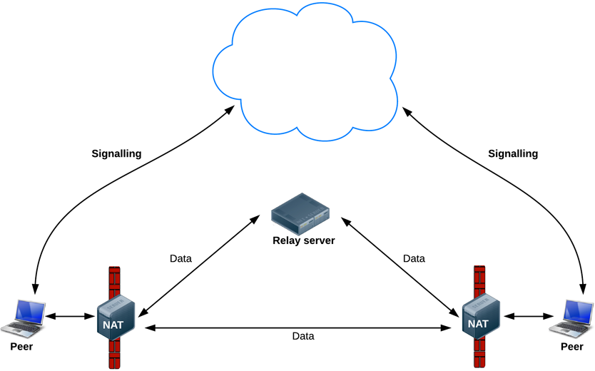
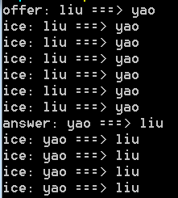

# WebRTC介绍    

这个文档主要介绍WebRTC相关知识。

Editor: PengBaowen (November 2017 )

文章在线阅读：https://github.com/bovinphang/WebRTC


## <a name='toc'>目录</a>


1. [什么是WebRTC？](#what-is-webrtc)
2. [浏览器兼容情况](#nodejs-install)
3. [特点](#features)
4. [WebRTC应用场景](#application-scenarios)
5. [WebRTC架构图](#webrtc-structure)
6. [WebRTC架构组件介绍](#component-introduction)
7. [WebRTC浏览器API](#web-api)
8. [WebRTC信令交换](#signaling-server)
9. [WebRTC点对点通信](#peer-to-peer)
10. [WebRTC核心模块API](#core-module-api)
11. [有用的链接](#Links)


## <a name='what-is-webrtc'>1. 什么是WebRTC？</a>

​       众所周知，浏览器本身不支持相互之间直接建立信道进行通信，都是通过服务器进行中转。比如现在有两个客户端，甲和乙，他们俩想要通信，首先需要甲和服务器、乙和服务器之间建立信道。甲给乙发送消息时，甲先将消息发送到服务器上，服务器对甲的消息进行中转，发送到乙处，反过来也是一样。这样甲与乙之间的一次消息要通过两段信道，通信的效率同时受制于这两段信道的带宽。同时这样的信道并不适合数据流的传输，如何建立浏览器之间的点对点传输，一直困扰着开发者。WebRTC应运而生。

​       WebRTC，名称源自网页实时通信（Web Real-Time Communication）的缩写，是一项实时通讯技术，它允许网络应用或者站点，在不借助中间媒介的情况下，建立浏览器之间点对点（Peer-to-Peer）的连接，实现视频流和（或）音频流或者其他任意数据的传输，支持网页浏览器进行实时语音对话或视频对话。WebRTC包含的这些标准使用户在无需安装任何插件或者第三方的软件的情况下，创建点对点（Peer-to-Peer）的数据分享和电话会议成为可能。它是谷歌2010年以6820万美元收购Global IP Solutions公司而获得的一项技术。该项目是由GIPS项目和libjingle项目融合而成。其中GIPS部分主要提供媒体的处理的功能。libjingle项目部分主要提供P2P传输部分的功能。2011年5月开放了工程的源代码，在行业内得到了广泛的支持和应用，成为下一代视频通话的标准。

​       WebRTC是一个开源项目，旨在使得浏览器能为实时通信（RTC）提供简单的JavaScript接口。说的简单明了一点就是让浏览器提供JS的即时通信接口。这个接口所创立的信道并不是像WebSocket一样，打通一个浏览器与WebSocket服务器之间的通信，而是通过一系列的信令，建立一个浏览器与浏览器之间（peer-to-peer）的信道，这个信道可以发送任何数据，而不需要经过服务器。并且WebRTC通过实现MediaStream，通过浏览器调用设备的摄像头、话筒，使得浏览器之间可以传递音频和视频。

​	关键要认识到的是，点对点并不意味着不涉及服务器，这只是意味着正常的数据没有经过它们。至少，两台客户机仍然需要一台服务器来交换一些基本信息（我在网络上的哪些位置，我支持哪些编解码器），以便他们可以建立对等的连接。用于建立对等连接的信息被称为信令，而服务器被称为信令服务器。

​	WebRTC没有规定您使用什么信令服务器或什么协议。 Websockets是最常见的，但也可以使用长轮询甚至电子邮件。

## <a name='what-webrtc'>2. 浏览器兼容情况</a>

​       这么好的功能，各大浏览器厂商自然不会置之不理。现在WebRTC已经可以在较新版的Chrome、Opera和Firefox、Edge中使用了，著名的浏览器兼容性查询网站[caniuse](http://caniuse.com/#feat=rtcpeerconnection)上给出了一份详尽的浏览器兼容情况：


另外：编写本地WebRTC客户端也是可能的。

## <a name='features'>3. 特点</a>

​       WebRTC实现了基于网页的视频会议，标准是WHATWG 协议，目的是通过浏览器提供简单的javascript就可以达到实时通讯（Real-Time Communications (RTC)）能力。

​        WebRTC（Web Real-Time Communication）项目的最终目的主要是让Web开发者能够基于浏览器（Chrome\FireFox\...）轻易快捷开发出丰富的实时多媒体应用，而无需下载安装任何插件，Web开发者也无需关注多媒体的数字信号处理过程，只需编写简单的Javascript程序即可实现，W3C等组织正在制定Javascript 标准API，目前是[WebRTC 1.0版本](http://w3c.github.io/webrtc-pc/)，Draft状态；另外WebRTC还希望能够建立一个多互联网浏览器间健壮的实时通信的平台，形成开发者与浏览器厂商良好的生态环境。同时，Google也希望和致力于让WebRTC的技术成为HTML5标准之一，可见Google布局之深远。

​        WebRTC提供了视频会议的核心技术，包括音视频的采集、编解码、网络传输、显示等功能，并且还支持跨平台：windows，linux，mac，android。

## <a name='application-scenarios'>4. WebRTC应用场景</a>

WebRTC的点对点方式能够运用在很多场景：

- 视频聊天室应用
- Web IM（如web qq）
- 屏幕共享
- 人脸检测识别
- 双人对战游戏（如象棋这种双人对战游戏，每一步的数据服务器时不关心的，所以完全可以点对点发送）
- 其它即时通信业务（如一对一在线面试、在线教育）

## <a name='webrtc-structure'>5. WebRTC架构图</a>

#### 

​                                                 **WebRTC architecture (from [webrtc.org](http://www.webrtc.org/reference/architecture))**

架构图颜色标识说明：

（1）紫色部分是Web开发者API层；

（2）蓝色实线部分是面向浏览器厂商的API层（也就是红色框标内模块，也是本人专注研究的部分）;

（3）蓝色虚线部分浏览器厂商可以自定义实现。

## <a name='component-introduction'>6. WebRTC架构组件介绍</a>

​ **(1) Your Web App**
​	Web开发者开发的程序，Web开发者可以基于集成WebRTC的浏览器提供的web API开发基于视频、音频的实时通信应用。

**(2) Web API**
​	面向第三方开发者的WebRTC标准API（Javascript），使开发者能够容易地开发出类似于网络视频聊天的web应用，最新的标准化进程可以查看[**这里**](http://dev.w3.org/2011/webrtc/editor/webrtc.html)。
**(3) WebRTC Native C++ API**
​	本地C++ API层，使浏览器厂商容易实现WebRTC标准的Web API，抽象地对数字信号过程进行处理。

**(4) Transport / Session**

​	传输/会话层，会话层组件采用了libjingle库的部分组件实现，无须使用xmpp/jingle协议

​	**a.  RTP Stack协议栈**
​	Real Time Protocol
​	**b.  STUN/ICE**
​	可以通过STUN和ICE组件来建立不同类型网络间的呼叫连接。
​	**c.  Session Management**
​	一个抽象的会话层，提供会话建立和管理功能。该层协议留给应用开发者自定义实现。

**(5) VoiceEngine**
​	音频引擎是包含一系列音频多媒体处理的框架，包括从视频采集卡到网络传输端等整个解决方案。
PS：VoiceEngine是WebRTC极具价值的技术之一，是Google收购GIPS公司后开源的。在VoIP上，技术业界领先，后面的文章会详细了解

​	**a.  iSAC**

​	Internet Speech Audio Codec

​	针对VoIP和音频流的宽带和超宽带音频编解码器，是WebRTC音频引擎的默认的编解码器
​	采样频率：16khz，24khz，32khz；（默认为16khz）
​	自适应速率为10kbit/s ~ 52kbit/；
​	自适应包大小：30~60ms；
​	算法延时：frame + 3ms

​	**b.  iLBC**
​	Internet Low Bitrate Codec
​	VoIP音频流的窄带语音编解码器
​	采样频率：8khz；
​	20ms帧比特率为15.2kbps
​	30ms帧比特率为13.33kbps
​	标准由IETF RFC3951和RFC3952定义

​	**c.  NetEQ for Voice**

​	针对音频软件实现的语音信号处理元件

​	NetEQ算法：自适应抖动控制算法以及语音包丢失隐藏算法。使其能够快速且高解析度地适应不断变化的网络环境，确保音质优美且缓冲延迟最小。是GIPS公司独步天下的技术，能够有效的处理由于网络抖动和语音包丢失时候对语音质量产生的影响。

​	PS：NetEQ 也是WebRTC中一个极具价值的技术，对于提高VoIP质量有明显效果，加以AEC\NR\AGC等模块集成使用，效果更好。

​	**d.  Acoustic Echo Canceler (AEC)**
​	回声消除器是一个基于软件的信号处理元件，能实时的去除mic采集到的回声。

​	**e.  Noise Reduction (NR)**
​	噪声抑制也是一个基于软件的信号处理元件，用于消除与相关VoIP的某些类型的背景噪声（嘶嘶声，风扇噪音等等… …）

**(6) VideoEngine**
​	WebRTC视频处理引擎
​	VideoEngine是包含一系列视频处理的整体框架，从摄像头采集视频到视频信息网络传输再到视频显示整个完整过程的解决方案。

​	**a.  VP8**
​	视频图像编解码器，是WebRTC视频引擎的默认的编解码器
​	VP8适合实时通信应用场景，因为它主要是针对低延时而设计的编解码器。
​	PS:VPx编解码器是Google收购ON2公司后开源的，VPx现在是WebM项目的一部分，而WebM项目是Google致力于推动的HTML5标准之一

​	**b.  Video Jitter Buffer**
​	视频抖动缓冲器，可以降低由于视频抖动和视频信息包丢失带来的不良影响。

​	**c.  Image enhancements**
​	图像质量增强模块
​	对网络摄像头采集到的图像进行处理，包括明暗度检测、颜色增强、降噪处理等功能，用来提升视频质量。

## <a name='web-api'>7. WebRTC浏览器API</a>

WebRTC实现了多个Web API接口，其中三个主要的Web API分别是:

- **[MediaStream](https://www.html5rocks.com/en/tutorials/webrtc/basics/#toc-mediastream)：**通过MediaStream的API能够通过设备的摄像头及话筒获得视频、音频的同步流。
- **[RTCPeerConnection](https://www.html5rocks.com/en/tutorials/webrtc/basics/#toc-rtcpeerconnection)：**RTCPeerConnection是WebRTC用于构建点对点之间稳定、高效的流传输的组件。
- **[RTCDataChannel](https://www.html5rocks.com/en/tutorials/webrtc/basics/#toc-rtcdatachannel)：**RTCDataChannel使得浏览器之间（点对点）建立一个高吞吐量、低延时的信道，用于传输任意数据。

这里大致介绍一下这三个API：

### 7.1 MediaStream (aka getUserMedia)

MediaStream API为WebRTC提供了从设备的摄像头、话筒获取视频、音频流数据的功能.

#### 7.1.1 W3C标准

详见：https://w3c.github.io/mediacapture-main/getusermedia.html

#### 7.1.2 如何调用？

可以通过`navigator.getUserMedia()`这个方法来调用，这个方法接受三个参数：

1. 一个约束对象（constraints object），这个后面会单独讲。
2. 一个调用成功的回调函数，如果调用成功，传递给它一个流对象。
3. 一个调用失败的回调函数，如果调用失败，传递给它一个错误对象。

#### 7.1.3 浏览器兼容性处理

由于浏览器实现不同，他们经常会在实现标准版本之前，在方法前面加上前缀，所以一个兼容版本就像这样：

```javascript
var getUserMedia = (navigator.getUserMedia || 
                    navigator.webkitGetUserMedia || 
                    navigator.mozGetUserMedia || 
                    navigator.msGetUserMedia);
```

#### 7.1.4 一个超级简单的例子

这里写一个超级简单的例子，用来展现getUserMedia的效果：

```html
<!DOCTYPE html>
<html>
<head>
  	<meta http-equiv="Content-Type" content="text/html; charset=utf-8" />
    <title>GetUserMedia实例</title>
</head>
<body>
    <video id="video" autoplay></video>
</body>

<script type="text/javascript">
    var getUserMedia = (navigator.getUserMedia || navigator.webkitGetUserMedia || navigator.mozGetUserMedia || navigator.msGetUserMedia);

    getUserMedia.call(navigator, {
        video: true,
        audio: true
    }, function(localMediaStream) {
        var video = document.getElementById('video');
        video.src = window.URL.createObjectURL(localMediaStream);
        video.onloadedmetadata = function(e) {
            console.log("Label: " + localMediaStream.label);
            console.log("AudioTracks" , localMediaStream.getAudioTracks());
            console.log("VideoTracks" , localMediaStream.getVideoTracks());
        };
    }, function(e) {
        console.log('Rejected!', e);
    });
</script>


</html>
```

将这段内容保存在一个HTML文件中，放在服务器上。用较新版本的Opera、Firefox、Chrome打开，在浏览器弹出询问是否允许访问摄像头和话筒，选同意，浏览器上就会出现摄像头所拍摄到的画面了.

注意，HTML文件要放在服务器上，否则会得到一个NavigatorUserMediaError的错误，显示PermissionDeniedError。

这里使用**getUserMedia**获得流之后，需要将其输出，一般是绑定到**video**标签上输出，需要使用**window.URL.createObjectURL(localMediaStream)**来创造能在video中使用src属性播放的Blob URL，注意在video上加入autoplay属性，否则只能捕获到一张图片

流创建完毕后可以通过**label**属性来获得其唯一的标识，还可以通过**getAudioTracks()**和**getVideoTracks()**方法来获得流的追踪对象数组（如果没有开启某种流，它的追踪对象数组将是一个空数组）

#### 7.1.5 约束对象(Constraints)

约束对象可以被设置在getUserMedia()和RTCPeerConnection的addStream方法中，这个约束对象是WebRTC用来指定接受什么样的流的，其中可以定义如下属性：

- video: 是否接受视频流
- audio：是否接受音频流
- MinWidth: 视频流的最小宽度
- MaxWidth：视频流的最大宽度
- MinHeight：视频流的最小高度
- MaxHiehgt：视频流的最大高度
- MinAspectRatio：视频流的最小宽高比
- MaxAspectRatio：视频流的最大宽高比
- MinFramerate：视频流的最小帧速率
- MaxFramerate：视频流的最大帧速率

### 7.2 RTCPeerConnection

WebRTC使用RTCPeerConnection来在浏览器之间传递流数据，这个流数据通道是点对点的，不需要经过服务器进行中转。但是这并不意味着我们能抛弃服务器，我们仍然需要它来为我们传递信令（signaling）来建立这个信道。WebRTC没有定义用于建立信道的信令的协议：信令并不是RTCPeerConnection API的一部分。

既然没有定义具体的信令的协议，我们就可以选择任意方式（AJAX、WebSocket），采用任意的协议（SIP、XMPP）来传递信令，建立信道。比如可以使用node的ws模块，在WebSocket上传递信令。

#### 7.2.1 浏览器兼容处理

还是前缀不同的问题，采用和上面类似的方法：

```javascript
var PeerConnection = (window.PeerConnection ||
                    window.webkitPeerConnection00 || 
                    window.webkitRTCPeerConnection || 
                    window.mozRTCPeerConnection);
```

#### 7.2.2 创建和使用

```javascript
//使用Google的stun服务器
var iceServer = {
    "iceServers": [{
        "url": "stun:stun.l.google.com:19302"
    }]
};
//兼容浏览器的getUserMedia写法
var getUserMedia = (navigator.getUserMedia ||
                    navigator.webkitGetUserMedia || 
                    navigator.mozGetUserMedia || 
                    navigator.msGetUserMedia);
//兼容浏览器的PeerConnection写法
var PeerConnection = (window.PeerConnection ||
                    window.webkitPeerConnection00 || 
                    window.webkitRTCPeerConnection || 
                    window.mozRTCPeerConnection);
//与后台服务器的WebSocket连接
var socket = __createWebSocketChannel();
//创建PeerConnection实例
var pc = new PeerConnection(iceServer);
//发送ICE候选到其他客户端
pc.onicecandidate = function(event){
    socket.send(JSON.stringify({
        "event": "__ice_candidate",
        "data": {
            "candidate": event.candidate
        }
    }));
};
//如果检测到媒体流连接到本地，将其绑定到一个video标签上输出
pc.onaddstream = function(event){
    someVideoElement.src = URL.createObjectURL(event.stream);
};
//获取本地的媒体流，并绑定到一个video标签上输出，并且发送这个媒体流给其他客户端
getUserMedia.call(navigator, {
    "audio": true,
    "video": true
}, function(stream){
    //发送offer和answer的函数，发送本地session描述
    var sendOfferFn = function(desc){
            pc.setLocalDescription(desc);
            socket.send(JSON.stringify({ 
                "event": "__offer",
                "data": {
                    "sdp": desc
                }
            }));
        },
        sendAnswerFn = function(desc){
            pc.setLocalDescription(desc);
            socket.send(JSON.stringify({ 
                "event": "__answer",
                "data": {
                    "sdp": desc
                }
            }));
        };
    //绑定本地媒体流到video标签用于输出
    myselfVideoElement.src = URL.createObjectURL(stream);
    //向PeerConnection中加入需要发送的流
    pc.addStream(stream);
    //如果是发送方则发送一个offer信令，否则发送一个answer信令
    if(isCaller){
        pc.createOffer(sendOfferFn);
    } else {
        pc.createAnswer(sendAnswerFn);
    }
}, function(error){
    //处理媒体流创建失败错误
});
//处理到来的信令
socket.onmessage = function(event){
    var json = JSON.parse(event.data);
    //如果是一个ICE的候选，则将其加入到PeerConnection中，否则设定对方的session描述为传递过来的描述
    if( json.event === "__ice_candidate" ){
        pc.addIceCandidate(new RTCIceCandidate(json.data.candidate));
    } else {
         pc.setRemoteDescription(new RTCSessionDescription(json.data.sdp));
    }
};
```

### 7.3 RTCDataChannel

既然能建立点对点的信道来传递实时的视频、音频数据流，为什么不能用这个信道传一点其他数据呢？RTCDataChannel API就是用来干这个的，基于它我们可以在浏览器之间传输任意数据。DataChannel是建立在PeerConnection上的，不能单独使用。

#### 7.3.1 使用DataChannel

我们可以使用`channel = pc.createDataCHannel(“someLabel”);`来在PeerConnection的实例上创建Data Channel，并给与它一个标签。

DataChannel使用方式几乎和WebSocket一样，有几个事件：

- onopen
- onclose
- onmessage
- onerror

同时它有几个状态，可以通过readyState获取：

- connecting: 浏览器之间正在试图建立channel
- open：建立成功，可以使用send方法发送数据了
- closing：浏览器正在关闭channel
- closed：channel已经被关闭了

两个暴露的方法:

- close(): 用于关闭channel
- send()：用于通过channel向对方发送数据

#### 7.3.2 通过Data Channel发送文件大致思路

JavaScript已经提供了File API从input[ type= ‘file’]的元素中提取文件，并通过**FileReader**来将文件的转换成DataURL，这也意味着我们可以将DataURL分成多个碎片来通过Channel来进行文件传输。

## <a name='signaling-server'>8. WebRTC信令交换</a>

本节讲述了WebRTC中所涉及的信令交换以及聊天室中的信令交换，主要内容来自于：[WebRTC in the real world: STUN, TURN and signaling](http://www.html5rocks.com/en/tutorials/webrtc/infrastructure/)

### 8.1 WebRTC的服务器

WebRTC提供浏览器之间的点对点信道进行数据传输，但是并不意味着WebRTC不需要服务器，建立这个信道，必须有服务器的参与。WebRTC需要服务器对其进行四方面的功能支持：

1. 用户发现以及通信；
2. 信令传输：浏览器之间交换建立通信的元数据（信令）；
3. NAT/防火墙穿越；
4. 如果点对点通信建立失败，可以作为中转服务器。

### 8.2 NAT/防火墙穿越技术

我们目前大部分人连接互联网时都处于防火墙后面或者配置私有子网的家庭(NAT)路由器后面,这就导致我们的计算机的IP地址不是广域网IP地址,故而不能相互之间直接通讯。 正因为这样的一个场景,我们得想办法去穿越这些防火墙或者家庭(NAT)路由器，让两个同处于私有网络里的计算机能够通讯起来。建立点对点信道的一个常见问题，也就是NAT穿越技术问题，即在处于使用了NAT设备的私有TCP/IP网络中的主机之间需要建立连接时需要使用NAT穿越技术。以往在VoIP领域经常会遇到这个问题。目前已经有很多NAT穿越技术，但没有一项是完美的，因为NAT的行为是非标准化的。这些技术中大多使用了一个公共服务器，这个服务使用了一个从全球任何地方都能访问得到的IP地址。


​     STUN(Simple Traversal of UDP over NATs,NAT 的UDP简单穿越)，STUN协议服务器就是用来解决这些问题:

​       1) 探测和发现通讯对方是否躲在防火墙或者NAT路由器后面。

​       2) 确定内网客户端所暴露在外的广域网的IP和端口以及NAT类型等信息;STUN服务器利用这些信息协助不同内网的计算机之间建立点对点的UDP通讯.

​       STUN协议可以很好的解决一般家用(NAT)路由器环境的打洞问题,但是对于大部分的企业的网络环境就不是很好了。

​       这时需要一个新的解决方案:TURN（Traversal Using Relay NAT，中继NAT实现的穿透）允许在TCP或UDP的连线上跨越 NAT 或防火墙。TURN是一个Client-Server协议。TURN的NAT穿透方法与STUN类似，都是通过取得应用层中的公有地址达到NAT穿透,但实现TURN client的终端必须在通讯开始前与TURN server进行交互,并要求TURN server产生"relay port", 也就是relayed-transport-address.这时 TURN server会建立peer,即远端端点（remote endpoints）, 开始进行中继（relay）的动作,TURN client利用relay port将资料传送至peer,再由peer转传到另一方的TURN client.通过服务器新产生的peer来进行数据的中转。

​        ICE就是综合前面2种协议的综合性NAT穿越解决方案。在RTCPeeConnection中，使用ICE框架来保证RTCPeerConnection能实现NAT穿越。

​	ICE，全名叫交互式连接建立（Interactive Connectivity Establishment）,一种综合性的NAT穿越技术，它是一种框架，可以整合各种NAT穿越技术如STUN、TURN。ICE会先使用STUN，尝试建立一个基于UDP的连接，如果失败了，就会去尝试TCP（先尝试HTTP，然后尝试HTTPS），如果依旧失败ICE就会使用一个中继的TURN服务器。

​	通过offer/answer模型建立基于UDP的通讯。ICE是offer/answer模型的扩展，通过在offer和answer的SDP(Session Description Protocol)里面包含多种IP地址和端口，然后对本地SDP和远程SDP里面的IP地址进行配对，然后通过P2P连通性检查进行连通性测试工作，如果测试通过即表明该传输地址对可以建立连接。其中IP地址和端口（也就是地址）有以下几种：本机地址、通过STUN服务器反射后获取的server-reflexive地址（内网地址被NAT映射后的地址）、relayed地址（和TURN转发服务器相对应的地址）及Peer reflexive地址等。

我们可以使用Google的STUN服器：**stun:stun.l.google.com:19302**，于是乎，一个整合了ICE框架的架构应该长这个样子 ：


​                                                                 **Finding connection candidates**



​                                                                           **WebRTC data pathways**


### 8.3 为什么需要信令？

我们需要通过一系列的信令来建立浏览器之间的通信。而具体需要通过信令交换哪些内容呢？这里大概列了一下：

1. 用来控制通信开启或者关闭的连接控制消息
2. 发生错误时用来彼此告知的消息
3. 媒体适配：媒体流元数据，比如像解码器、解码器的配置、带宽、媒体类型等等
4. 用来建立安全连接的关键数据
5. 网络配置：外界所看到的的网络上的数据，比如IP地址、端口等

这些信息的交换应该在点对点的流传输之前就全部完成。在建立连接之前，浏览器之间显然没有办法传递数据。所以我们需要通过服务器的中转，在浏览器之间传递这些数据，然后建立浏览器之间的点对点连接。但是WebRTC API中并没有实现这些。

### 8.4 为什么WebRTC不去实现信令交换？

不去由WebRTC实现信令交换的原因很简单：WebRTC标准的制定者们希望能够最大限度地兼容已有的成熟技术。具体的连接建立方式由一种叫JSEP（JavaScript Session Establishment Protocol）的协议来规定，使用JSEP有两个好处：

1. 在JSEP中，需要交换的关键信息是多媒体会话描述（multimedia session description）。由于开发者在其所开发的应用程序中信令所使用的协议不同（SIP或是XMPP或是开发者自己定义的协议），WebRTC建立呼叫的思想建立在媒体流控制层面上，从而与上层信令传输相分离，防止相互之间的信令污染。只要上层信令为其提供了多媒体会话描述符这样的关键信息就可以建立连接，不管开发者用何种方式来传递。


2. JSEP的架构同时也避免了在浏览器上保存连接的状态，防止其像一个状态机一样工作。由于页面经常被频繁的刷新，如果连接的状态保存在浏览器中，每次刷新都会丢失。使用JSEP能使得状态被保存在服务器上。


​										**JSEP architecture**


### 8.5 会话描述协议（Session Description Protocol）

JSEP将客户端之间传递的信令分为两种:offer信令和answer信令。他们主要内容的格式都遵循会话描述协议（Session Description Protocal，简称SDP）。一个SDP的信令的内容大致上如下：

```protobuf
v=0
o=- 7806956 075423448571 2 IN IP4 127.0.0.1
s=-
t=0 0
a=group:BUNDLE audio video data
a=msid-semantic: WMS 5UhOcZZB1uXtVbYAU5thB0SpkXbzk9FHo30g
m=audio 1 RTP/SAVPF 111 103 104 0 8 106 105 13 126
c=IN IP4 0.0.0.0
a=rtcp:1 IN IP4 0.0.0.0
a=ice-ufrag:grnpQ0BSTSnBLroq
a=ice-pwd:N5i4DZKMM2L7FEYnhO8V7Kg5
a=ice-options:google-ice
a=fingerprint:sha-256 01:A3:18:0E:36:5E:EF:24:18:8C:8B:0C:9E:B0:84:F6:34:E9:42:E3:0F:43:64:ED:EC:46:2C:3C:23:E3:78:7B
a=setup:actpass
a=mid:audio
a=extmap:1 urn:ietf:params:rtp-hdrext:ssrc-audio-level
a=recvonly
a=rtcp-mux
a=crypto:1 AES_CM_128_HMAC_SHA1_80 inline:qzcKu22ar1+lYah6o8ggzGcQ5obCttoOO2IzXwFV
a=rtpmap:111 opus/48000/2
a=fmtp:111 minptime=10
a=rtpmap:103 ISAC/16000
a=rtpmap:104 ISAC/32000
a=rtpmap:0 PCMU/8000
a=rtpmap:8 PCMA/8000
a=rtpmap:106 CN/32000
a=rtpmap:105 CN/16000
a=rtpmap:13 CN/8000
a=rtpmap:126 telephone-event/8000
a=maxptime:60
m=video 1 RTP/SAVPF 100 116 117
c=IN IP4 0.0.0.0
a=rtcp:1 IN IP4 0.0.0.0
a=ice-ufrag:grnpQ0BSTSnBLroq
a=ice-pwd:N5i4DZKMM2L7FEYnhO8V7Kg5
a=ice-options:google-ice
a=fingerprint:sha-256 01:A3:18:0E:36:5E:EF:24:18:8C:8B:0C:9E:B0:84:F6:34:E9:42:E3:0F:43:64:ED:EC:46:2C:3C:23:E3:78:7B
a=setup:actpass
a=mid:video
a=extmap:2 urn:ietf:params:rtp-hdrext:toffset
a=extmap:3 http://www.webrtc.org/experiments/rtp-hdrext/abs-send-time
a=sendrecv
a=rtcp-mux
a=crypto:1 AES_CM_128_HMAC_SHA1_80 inline:qzcKu22ar1+lYah6o8ggzGcQ5obCttoOO2IzXwFV
a=rtpmap:100 VP8/90000
a=rtcp-fb:100 ccm fir
a=rtcp-fb:100 nack
a=rtcp-fb:100 goog-remb
a=rtpmap:116 red/90000
a=rtpmap:117 ulpfec/90000
a=ssrc:3162115896 cname:/nERF7Ern+udqf++
a=ssrc:3162115896 msid:5UhOcZZB1uXtVbYAU5thB0SpkXbzk9FHo30g 221b204e-c9a0-4b01-b361-e17e9bf8f639
a=ssrc:3162115896 mslabel:5UhOcZZB1uXtVbYAU5thB0SpkXbzk9FHo30g
a=ssrc:3162115896 label:221b204e-c9a0-4b01-b361-e17e9bf8f639
m=application 1 DTLS/SCTP 5000
c=IN IP40.0.0.0
a=ice-ufrag:grnpQ0BSTSnBLroq
a=ice-pwd:N5i4DZKMM2L7FEYnhO8V7Kg5
a=ice-options:google-ice
a=fingerprint:sha-256 01:A3:18:0E:36:5E:EF:24:18:8C:8B:0C:9E:B0:84:F6:34:E9:42:E3:0F:43:64:ED:EC:46:2C:3C:23:E3:78:7B
a=setup:actpass
a=mid:data
a=sctpmap:5000 webrtc-datachannel 1024
```

它是一个在点对点连接中描述自己的字符串，我们可以将其封装在JSON中进行传输，在PeerConnection建立后将其通过服务器中转后，将自己的SDP描述符和对方的SDP描述符交给PeerConnection就行了。若想深入了解，可以参考[SDP for the WebRTC draft-nandakumar-rtcweb-sdp-04](http://datatracker.ietf.org/doc/draft-nandakumar-rtcweb-sdp/?include_text=1)进行解析。

### 8.6 信令与RTCPeerConnection建立

在上一章节中介绍过，WebRTC使用RTCPeerConnection来在浏览器之间传递流数据，在建立RTCPeerConnection实例之后，想要使用其建立一个点对点的信道，我们需要做两件事：

1. 确定本机上的媒体流的特性，比如分辨率、编解码能力啥的（SDP描述符）
2. 连接两端的主机的网络地址（ICE Candidate）

需要注意的是，由于连接两端的主机都可能在内网或是在防火墙之后，我们需要一种对所有联网的计算机都通用的定位方式。这其中就涉及NAT/防火墙穿越技术，以及WebRTC用来达到这个目的所ICE框架。这一部分在上一章节中有介绍，这里不再赘述。

### 8.7 通过offer和answer交换SDP描述符

大致上在两个用户（甲和乙）之间建立点对点连接流程应该是这个样子（这里不考虑错误的情况，RTCPeerConnection简称PC）：

1. 甲和乙各自建立一个PC实例
2. 甲通过PC所提供的`createOffer()`方法建立一个包含甲的SDP描述符的offer信令
3. 甲通过PC所提供的`setLocalDescription()`方法，将甲的SDP描述符交给甲的PC实例
4. 甲将offer信令通过服务器发送给乙
5. 乙将甲的offer信令中所包含的的SDP描述符提取出来，通过PC所提供的`setRemoteDescription()`方法交给乙的PC实例
6. 乙通过PC所提供的`createAnswer()`方法建立一个包含乙的SDP描述符answer信令
7. 乙通过PC所提供的`setLocalDescription()`方法，将乙的SDP描述符交给乙的PC实例
8. 乙将answer信令通过服务器发送给甲
9. 甲接收到乙的answer信令后，将其中乙的SDP描述符提取出来，调用`setRemoteDescripttion()`方法交给甲自己的PC实例

通过在这一系列的信令交换之后，甲和乙所创建的PC实例都包含甲和乙的SDP描述符了，完成了两件事的第一件。我们还需要完成第二件事——获取连接两端主机的网络地址。

### 8.8 通过ICE框架建立NAT/防火墙穿越的连接

这个网络地址应该是能从外界直接访问，WebRTC使用ICE框架来获得这个地址。RTCPeerConnection在创立的时候可以将ICE服务器的地址传递进去，如：

```javascript
var iceServer = {
    "iceServers": [{
        "url": "stun:stun.l.google.com:19302"
    }]
};
var pc = new RTCPeerConnection(iceServer);
```

当然这个地址也需要交换，还是以甲乙两位为例，交换的流程如下（RTCPeerConnection简称PC）：

1. 甲、乙各创建配置了ICE服务器的PC实例，并为其添加`onicecandidate`事件回调
2. 当网络候选可用时，将会调用`onicecandidate`函数
3. 在回调函数内部，甲或乙将网络候选的消息封装在ICE Candidate信令中，通过服务器中转，传递给对方
4. 甲或乙接收到对方通过服务器中转所发送过来ICE Candidate信令时，将其解析并获得网络候选，将其通过PC实例的`addIceCandidate()`方法加入到PC实例中

这样连接就创立完成了，可以向RTCPeerConnection中通过`addStream()`加入流来传输媒体流数据。将流加入到RTCPeerConnection实例中后，对方就可以通过`onaddstream`所绑定的回调函数监听到了。调用`addStream()`可以在连接完成之前，在连接建立之后，对方一样能监听到媒体流。

### 8.9 聊天室中的信令

上面是两个用户之间的信令交换流程，但我们需要建立一个多用户在线视频聊天的聊天室。所以需要进行一些扩展，来达到这个要求。

#### 8.9.1 用户操作

首先需要确定一个用户在聊天室中的操作大致流程：

1. 打开页面连接到服务器上
2. 进入聊天室
3. 与其他所有已在聊天室的用户建立点对点的连接，并输出在页面上
4. 若有聊天室内的其他用户离开，应得到通知，关闭与其的连接并移除其在页面中的输出
5. 若又有其他用户加入，应得到通知，建立于新加入用户的连接，并输出在页面上
6. 离开页面，关闭所有连接

从上面可以看出来，除了点对点连接的建立，还需要服务器至少做如下几件事：

1. 新用户加入房间时，发送新用户的信息给房间内的其他用户
2. 新用户加入房间时，发送房间内的其他用户信息给新加入房间的用户
3. 用户离开房间时，发送离开用户的信息给房间内的其他用户

#### 8.9.2 实现思路

以使用WebSocket为例，上面用户操作的流程可以进行以下修改：

1. 浏览器与服务器建立WebSocket连接
2. 发送一个加入聊天室的信令（join），信令中需要包含用户所进入的聊天室名称
3. 服务器根据用户所加入的房间，发送一个其他用户信令（peers），信令中包含聊天室中其他用户的信息，浏览器根据信息来逐个构建与其他用户的点对点连接
4. 若有用户离开，服务器发送一个用户离开信令（remove_peer），信令中包含离开的用户的信息，浏览器根据信息关闭与离开用户的信息，并作相应的清除操作
5. 若有新用户加入，服务器发送一个用户加入信令（new_peer），信令中包含新加入的用户的信息，浏览器根据信息来建立与这个新用户的点对点连接
6. 用户离开页面，关闭WebSocket连接

#### 8.9.3 服务器实现

由于用户可以只是建立连接，可能还没有进入具体房间，所以首先我们需要一个容器来保存所有用户的连接，同时监听用户是否与服务器建立了WebSocket的连接：

```javascript
var server = new WebSocketServer();
var sockets = [];

server.on('connection', function(socket){
    socket.on('close', function(){
        var i = sockets.indexOf(socket);
        sockets.splice(i, 1);
        //关闭连接后的其他操作
    });
    sockets.push(socket);
    //连接建立后的其他操作
});
```

由于有房间的划分，所以我们需要在服务器上建立一个容器，用来保存房间内的用户信息。显然对象较为合适，键为房间名称，值为用户信息列表。

同时我们需要监听上面所说的用户加入房间的信令（join），新用户加入之后需要向新用户发送房间内其他用户信息（peers）和向房间内其他用户发送新用户信息（new_peer），以及用户离开时向其他用户发送离开用户的信息（remove_peer）:

于是乎代码大致就变成这样：

```javascript
var server = new WebSocketServer();
var sockets = [];
var rooms = {};

/*
join信令所接收的格式
{
    "eventName": "join",
    "data": {
        "room": "roomName"
    }
}
*/
var joinRoom = function(data, socket) {
    var room = data.room || "__default";
    var curRoomSockets; //当前房间的socket列表
    var socketIds = []; //房间其他用户的id

    curRoomSockets = rooms[room] = rooms[room] || [];

    //给所有房间内的其他人发送新用户的id
    for (var i = curRoomSockets.length; i--;) {
        socketIds.push(curRoomSockets[i].id);
        curRoomSockets[i].send(JSON.stringify({
            "eventName": "new_peer",
            "data": {
                "socketId": socket.id
            }
        }));
    }

    //将新用户的连接加入到房间的连接列表中
    curRoomSockets.push(socket);
    socket.room = room;

    //给新用户发送其他用户的信息，及服务器给新用户自己赋予的id
    socket.send(JSON.stringify({
        "eventName": "peers",
        "data": {
            "socketIds": socketIds,
            "you": socket.id
        }
    }));
};

server.on('connection', function(socket) {
    //为socket构建一个特有的id，用来作为区分用户的标记
    socket.id = getRandomString();
    //用户关闭连接后，应做的处理
    socket.on('close', function() {
        var i = sockets.indexOf(socket);
        var room = socket.room;
        var curRoomSockets = rooms[room];
        sockets.splice(i, 1);
        //通知房间内其他用户
        if (curRoomSockets) {
            for (i = curRoomSockets.length; i--;) {
                curRoomSockets[i].send(JSON.stringify({
                    "eventName": "remove_peer",
                    "data": {
                        "socketId": socket.id
                    }
                }));
            }
        }
        //从room中删除socket
        if (room) {
            i = this.rooms[room].indexOf(socket);
            this.rooms[room].splice(i, 1);
            if (this.rooms[room].length === 0) {
                delete this.rooms[room];
            }
        }
        //关闭连接后的其他操作
    });
    //根据前台页面传递过来的信令进行解析，确定应该如何处理
    socket.on('message', function(data) {
        var json = JSON.parse(data);
        if (json.eventName) {
            if (json.eventName === "join") {
                joinRoom(data, socket);
            }
        }
    });
    //将连接保存
    sockets.push(socket);
    //连接建立后的其他操作
});
```

最后再加上点对点的信令转发就行了，一份完整的代码可参考[SkyRTC项目源码](https://github.com/LingyuCoder/SkyRTC/blob/master/SkyRTC.js)


## <a name='peer-to-peer'>9. WebRTC点对点通信</a>

WebRTC给我们带来了浏览器中的视频、音频聊天体验。但个人认为，它最实用的特性莫过于DataChannel——在浏览器之间建立一个点对点的数据通道。在DataChannel之前，浏览器到浏览器的数据传递通常是这样一个流程：浏览器A发送数据给服务器，服务器处理，服务器再转发给浏览器B。这三个过程都会带来相应的消耗，占用服务器带宽不说，还减缓了消息从发送到接收的时间。其实最理想的方式就是浏览器A直接与浏览B进行通信，服务器不需要参与其中。WebRTC DataChannel就提供了这样一种方式。当然服务器完全不参与其中，显然是不可能的，用户需要通过服务器上存储的信息，才能确定需要和谁建立连接。这里通过一个故事来讲述建立连接的过程：

####9.1 DataChannel连接的建立

**故事一：老刘和老姚去钓鱼**

背景：

- 老刘和老姚都住在同一个小区但不同的片区，小区很破旧，没有电话
- 片区相互隔离且片区门口有个保安，保安只认识自己片区的人，遇到不认识的人就需要查询凭证才能通过，而凭证需要找物业才能确定
- 门卫老大爷认识小区里的所有人但是不知道都住哪，有什么消息都可以在出入小区的时候代为传达

现在，老刘听说老姚钓鱼技术高超，想和老姚讨论钓鱼技巧。只要老刘和老姚相互之间知道对方的门牌号以及凭证，就可以串门了:

1. 门卫老大爷认识老刘和老姚
2. 老刘找物业确定了自己片区的出入凭证，将凭证、自己的门牌号以及意图告诉门卫老大爷，让其转交给老姚
3. 老姚买菜归来遇到门卫老大爷，门卫老大爷将老刘的消息传达给老姚。于是老姚知道怎么去老刘家了
4. 老姚很开心，他也找物业获取了自己小区的凭证，并将凭证、自己的门牌号等信息交给门卫老大爷，希望他传达给老刘
5. 老刘吃早餐回来遇到门卫老大爷，老大爷把老姚的小区凭证、门牌号等信息告诉老刘，这样老刘就知道了怎么去老姚家了

老刘和老姚相互之间知道了对方的门牌号和小区出入凭证，他们相互之间有什么需要交流的直接串门就行了，消息不再需要门卫老大爷来代为传达了

**换个角度**

我们把角色做一个映射：

- 老刘：浏览器A
- 老姚：浏览器B
- 片区：不同网段
- 保安：防火墙
- 片区凭证：ICE candidate
- 物业：ICE server
- 门牌号：session description
- 门卫老大爷：server

于是乎故事就变成了这样：

1. 浏览器A和浏览器B在server上注册，并保有连接
2. 浏览器A从ice server获取ice candidate并发送给server，并生成包含session description的offer，发送给server
3. server发送浏览器A的offer和ice candidate给浏览器B
4. 浏览器B发送包含session description的answer和ice candidate给server
5. server发送浏览器B的answer和ice candidate给浏览器A

这样，就建立了一个点对点的信道，流程如下所示：




#### 9.2 DataChannel的分片传输

**故事二：老姚送礼物**

老刘和老姚已经可以相互串门了，经过一段时间的交流感情越来越深。老姚的亲友送了20斤葡萄给老姚，老姚决定送10斤给老刘。老姚毕竟年事已高，不可能一次带10斤。于是乎，老姚将葡萄分成了10份，每次去老刘家串门就送一份过去。

这里可以做如下类比：

1. 10斤葡萄：一个文件（尽管文件分片没有意义，葡萄分开还可以单独吃，但是实在找不到啥好的比喻了）
2. 分成10份：将文件分片，转成多个chunk
3. 老姚一次只能带一斤：datachannel每次传输的数据量不宜太大（[找到最合适的大小](http://stackoverflow.com/questions/15435121/what-is-the-maximum-size-of-webrtc-data-channel-messages)）

这其实就是通过datachannel传输文件的方式，首先将文件分片，然后逐个发送，最后再统一的进行组合成一个新的文件

**分片**

通过HTML5的File API可以将type为file的input选中的文件读取出来，并转换成data url字符串。这也就为我们提供了很方便的分片方式：

```javascript
var reader = new window.FileReader(file);
reader.readAsDataURL(file);
reader.onload = function(event, text) {
    chunkify(event.target.result);//将数据分片
};
```

**组合**

通过datachannel发送的分片数据，我们需要将其进行组合，由于是data url字符串，在接收到所有包之后进行拼接就可以了。拼接完成后就得到了一个文件完整的data url字符串，那么我们如何将这个字符串转换成文件呢？

方案一：直接跳转下载

既然是个dataurl，我们直接将其赋值给window.location.href自然可以下载，但是这样下载是没法设定下载后的文件名的，这想一想都蛋疼

方案二：通过a标签下载

这个原理和跳转下载类似，都是使用dataurl本身的特性，通过创建一个a标签，将dataurl字符串赋值给href属性，然后使用download确定下载后的文件名，就可以完成下载了。但是很快又有新问题了，稍微大一点的文件下载的时候页面崩溃了。这是因为dataurl有大小限制

方案三：blob

其实可以通过给a标签创建blob url的方式来进行下载，这个没有大小限制。但是我们手上是dataurl，所以需要先进行转换：

```javascript
function dataURItoBlob(dataURI, dataTYPE) {
    var binary = atob(dataURI.split(',')[1]),
        array = [];
    for (var i = 0; i < binary.length; i++) array.push(binary.charCodeAt(i));
    return new Blob([new Uint8Array(array)], {
        type: dataTYPE
    });
}
```

获得blob后，我们就可以通过URL API来下载了：

```javascript
var a = document.createElement("a");
document.body.appendChild(a);
a.style = "display: none";
var blob = dataURItoBlob(data, 'octet/stream');
var url = window.URL.createObjectURL(blob);
a.href = url;
a.download = filename;
a.click();
!moz && window.URL.revokeObjectURL(url);
a.parentNode.removeChild(a);
```

这里有几个点：

1. datachannel其实是可以直接传送blob的，但是只有firefox支持，所以传data url
2. chrome下载是直接触发的，不会进行询问，firefox会先询问后下载，在询问过程中如果执行了revokeObjectURL，下载就会取消。


#### 9.3 DataChannel传输的升级

如我们所知，WebRTC最有特点的地方其实是可以传输getUserMedia获得的视频、音频流，来实现视频聊天。但事实上我们的使用习惯来看，一般人不会一开始就打开视频聊天，而且视频聊天时很消耗内存的（32位机上一个连接至少20M左右好像，也有可能有出入）。所以常见的需求是，先建立一个包含datachannel的连接用于传输数据，然后在需要时升级成可以传输视频、音频。

看看我们之前传输的session description，它其实来自[Session Description Protocol](http://datatracker.ietf.org/doc/draft-nandakumar-rtcweb-sdp/?include_text=1)。可以看到wiki上的介绍：

> The Session Description Protocol (SDP) is a format for describing streaming media initialization parameters.

这意味着什么呢？我们之前建立datachannel是没有加视频、音频流的，而这个流的描述是写在SDP里面的。现在我们需要传输视频、音频，就需要添加这些描述。所以就得重新获得SDP，然后构建offer和answer再传输一次。传输的流程和之前一样，没什么区别。但这一次，我们不需要传输任何的ice candidate。

> from mattm: You do not need to send ICE candidates on an already established peer connection. The ICE candidates are to make sure the two peers can establish a connection through their potential NAT and firewalls. If you can already send data on the peer connection, ICE candidates will not do anything.

****


## <a name='core-module-api'>10. WebRTC核心模块API</a>

### 10.1 网络传输模块：libjingle

WebRTC重用了libjingle的一些组件，主要是network和transport组件，关于libjingle的文档资料可以查看[**这里**](http://code.google.com/apis/talk/libjingle/developer_guide.html)。

### 10.2 音频、视频图像处理的主要数据结构

**常量\VideoEngine\VoiceEngine**

*注意：以下所有的方法、类、结构体、枚举常量等都在webrtc命名空间里*

| **类、结构体、枚举常量**        | **头文件**        | **说明**                                   |
| --------------------- | -------------- | ---------------------------------------- |
| **Structures**        | common_types.h | Lists the structures common to the VoiceEngine & VideoEngine |
| **Enumerators**       | common_types.h | List the enumerators common to the  VoiceEngine & VideoEngine |
| **Classes**           | common_types.h | List the classes common to VoiceEngine & VideoEngine |
| class **VoiceEngine** | voe_base.h     | How to allocate and release resources for the VoiceEngine using factory methods in the VoiceEngine class. It also lists the APIs which are required to enable file tracing and/or traces as callback messages |
| class **VideoEngine** | vie_base.h     | How to allocate and release resources for the VideoEngine using factory methods in the VideoEngine class. It also lists the APIs which are required to enable file tracing and/or traces as callback messages |

### 10.3 音频引擎（VoiceEngine）模块 APIs

*下表列的是目前在 VoiceEngine中可用的sub APIs*

| **sub-API**            | **头文件**                | **说明**                                   |
| ---------------------- | ---------------------- | ---------------------------------------- |
| **VoEAudioProcessing** | voe_audio_processing.h | Adds support for Noise Suppression (NS), Automatic Gain Control (AGC) and Echo Control (EC). Receiving side VAD is also included. |
| **VoEBase**            | voe_base.h             | Enables full duplex VoIP using G.711.**NOTE:** This API must always be created. |
| **VoECallReport**      | voe_call_report.h      | Adds support for call reports which contains number of dead-or-alive detections, RTT measurements, and Echo metrics. |
| **VoECodec**           | voe_codec.h            | Adds non-default codecs (e.g. iLBC, iSAC, G.722 etc.), Voice Activity Detection (VAD) support. |
| **VoEDTMF**            | voe_dtmf.h             | Adds telephone event transmission, DTMF tone generation and telephone event detection. (Telephone events include DTMF.) |
| **VoEEncryption**      | voe_encryption.h       | Adds external encryption/decryption support. |
| **VoEErrors**          | voe_errors.h           | Error Codes for the VoiceEngine          |
| **VoEExternalMedia**   | voe_external_media.h   | Adds support for external media processing and enables utilization of an external audio resource. |
| **VoEFile**            | voe_file.h             | Adds file playback, file recording and file conversion functions. |
| **VoEHardware**        | voe_hardware.h         | Adds sound device handling, CPU load monitoring and device information functions. |
| **VoENetEqStats**      | voe_neteq_stats.h      | Adds buffer statistics functions.        |
| **VoENetwork**         | voe_network.h          | Adds external transport, port and address filtering, Windows QoS support and packet timeout notifications. |
| **VoERTP_RTCP**        | voe_rtp_rtcp.h         | Adds support for RTCP sender reports, SSRC handling, RTP/RTCP statistics, Forward Error Correction (FEC), RTCP APP, RTP capturing and RTP keepalive. |
| **VoEVideoSync**       | voe_video_sync.h       | Adds RTP header modification support, playout-delay tuning and monitoring. |
| **VoEVolumeControl**   | voe_volume_control.h   | Adds speaker volume controls, microphone volume controls, mute support, and additional stereo scaling methods. |

### 10.4 视频引擎（VideoEngine）模块 APIs

*下表列的是目前在 VideoEngine中可用的sub APIs*

| **sub-API**          | **头文件**              | **说明**                                   |
| -------------------- | -------------------- | ---------------------------------------- |
| **ViEBase**          | vie_base.h           | Basic functionality for creating a VideoEngine instance, channels and VoiceEngine interaction.**NOTE:** This API must always be created. |
| **ViECapture**       | vie_capture.h        | Adds support for capture device allocation as well as capture device capabilities. |
| **ViECodec**         | vie_codec.h          | Adds non-default codecs, codec settings and packet loss functionality. |
| **ViEEncryption**    | vie_encryption.h     | Adds external encryption/decryption support. |
| **ViEErrors**        | vie_errors.h         | Error codes for the VideoEngine          |
| **ViEExternalCodec** | vie_external_codec.h | Adds support for using external codecs.  |
| **ViEFile**          | vie_file.h           | Adds support for file recording, file playout, background images and snapshot. |
| **ViEImageProcess**  | vie_image_process.h  | Adds effect filters, deflickering, denoising and color enhancement. |
| **ViENetwork**       | vie_network.h        | Adds send and receive functionality, external transport, port and address filtering, Windows QoS support, packet timeout notification and changes to network settings. |
| **ViERender**        | vie_render.h         | Adds rendering functionality.            |
| **ViERTP_RTCP**      | vie_rtp_rtcp.h       | Adds support for RTCP reports, SSRS handling RTP/RTCP statistics, NACK/FEC, keep-alive functionality and key frame request methods. |


## <a name='Links'>11. 有用的链接</a>

### 11. 1 Specifications:
* WebRTC 1.0: Real-time Communication Between Browsers：https://www.w3.org/TR/webrtc/
* Media Capture and Streams：https://w3c.github.io/mediacapture-main/
* Media Capture from DOM Elements：https://w3c.github.io/mediacapture-fromelement/

### 11. 2 Getting started:
WebRTC官方网站：https://webrtc.org/start/

A Study of WebRTC Security：http://webrtc-security.github.io/

### 11. 3 Tutorials:
https://www.html5rocks.com/en/tutorials/webrtc/basics/

### 11. 4  WebRTC API:
https://developer.mozilla.org/zh-CN/docs/Web/API/WebRTC_API

### 11. 5  WebRTC codelab:
A step-by-step guide that explains how to build a complete video chat app, including a simple signaling server.  https://www.bitbucket.org/webrtc/codelab

### 11. 6 Javascript frameworks
1. Video chat:
  * https://github.com/andyet/SimpleWebRTC
  * https://github.com/priologic/easyrtc
  * https://github.com/webRTC-io/webRTC.io

2. Peer-to-peer data:
  * http://peerjs.com/
  * https://github.com/peer5/sharefest

### 11. 7 Demos:
https://webrtc.github.io/samples/

https://www.webrtc-experiment.com/

### 11. 8 WebRTC服务提供商:
1. 国外:
  * https://xirsys.com
  * https://tokbox.com/developer/
  * https://cloud.aculab.com/documents/webrtcdemo
  * https://www.twilio.com/webrtc
  * http://www.frafos.com/webrtc/
  * http://www.sightcall.com/
2. 国内:
  * 融云：http://www.rongcloud.cn/
  * 亲加云：http://www.gotye.com.cn/
  * 环信：https://www.easemob.com/

